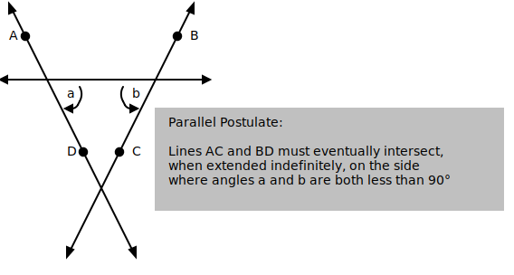
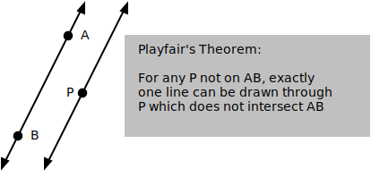
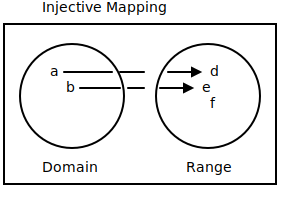
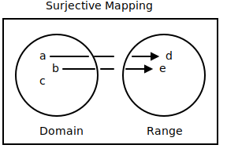
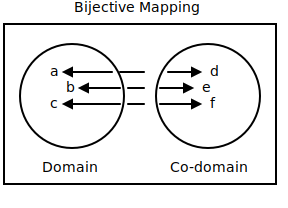

# rader.us

```bash
# create the project directory
mkdir rader.us
cd rader.us

# initialize a node project
npm init

# add vitepress as a dev dependency
npm add -D vitepress

# initialize vitepress
npx vitepress init

# add to .gitignore
cat << EOF > .gitignore
node_modules
.vitepress/cache
.vitepress/dist
.~*
*~
dist.zip
EOF

# add mathjax support
# see
# https://vitepress.dev/guide/markdown#math-equations
# for instructions on modifying .vitepress/config.mjs
npm add -D markdown-it-mathjax3

# add mermaid extension, see
# https://emersonbottero.github.io/vitepress-plugin-mermaid/guide/getting-started.html
# for instructions on modifying .vitepress/config.mjs
npm i vitepress-plugin-mermaid mermaid -D

# add dependency on CSV parser used by music.data.js
npm i csv-parse

# additionl markdown-it plugins
npm i markdown-it-collapsible
npm i markdown-it-graphviz-exec

# run dev server
npm run docs:dev
```

* See <https://vitepress.dev/reference/default-theme-config> for the default
  theme documentation
* See <https://vitepress.dev/guide/markdown> for the list of vitepress markdown
  extensions
* See <https://vitepress.dev/reference/runtime-api> for the vitepress API

## bobsvg sources

See <https://ivanceras.github.io/svgbob-editor/> for what these are.

### Euclid's Fifth ('Parallel') Postulate

```
 ^                        ^
  \                      /
 A *                    * B
    \                  /
     \                /
<-----\--------------/------>
       \ a )    ( b /
        \<'      `>/ +-----------------------------------------------+
         \        /  | "Parallel Postulate:"                         |
          \      /   |                                               |
         D *    * C  | "Lines AC and BD must eventually intersect,"  |
            \  /     | "when extended indefinitely, on the side"     |
             \/      | "where angles a and b are both less than 90°" |
             /\      | {note}                                        |
            /  \     +-----------------------------------------------+
           /    \
          /      \
         v        v

# Legend:
note = {
  fill: silver;
  stroke: silver;
}
```



### Playfair's Theorem

```
           ^     ^
          /     /
         * A   / +---------------------------------+
        /     /  | "Playfair's Theorem:"           |
       /     /   |                                 |
      /     /    | "For any P not on AB, exactly"  |
     /   P *     | "one line can be drawn through" |
    /     /      | "P which does not intersect AB" |
   /     /       | {note}                          |
  * B   /        +---------------------------------+
 /     /
V     v

# Legend:
note = {
  stroke: silver;
  fill: silver;
}
```



### Mappings

#### Injection

```
     "Injective Mapping"
+---------------------------------+
|     ______           ______     |
|   ,'      `.       ,'      `.   |
|  /  a ------\---  /---> d    \  |
| |     b -----|-- |---> e      | |
| |            |   |      f     | |
|  \          /     \          /  |
|   `.______.'       `.______.'   |
|                                 |
|    "Domain"          "Range"    |
+---------------------------------+
```



#### Surjection

```
       "Surjective Mapping"
+---------------------------------+
|     ______           ______     |
|   ,'      `.       ,'      `.   |
|  /  a ------\---  /---> d    \  |
| |     b -----|-- |---> e      | |
| |   c        |   |            | |
|  \          /     \          /  |
|   `.______.'       `.______.'   |
|                                 |
|     "Domain"         "Range"    |
+---------------------------------+
```



#### Bijection

```
         "Bijective Mapping"
+---------------------------------+
|     ______           ______     |
|   ,'      `.       ,'      `.   |
|  /  a <-----\---  /---> d    \  |
| |     b <----|-- |---> e      | |
| |   c <------|-- |----> f     | |
|  \          /     \          /  |
|   `.______.'       `.______.'   |
|                                 |
|    "Domain"        "Co-domain"  |
+---------------------------------+
```


