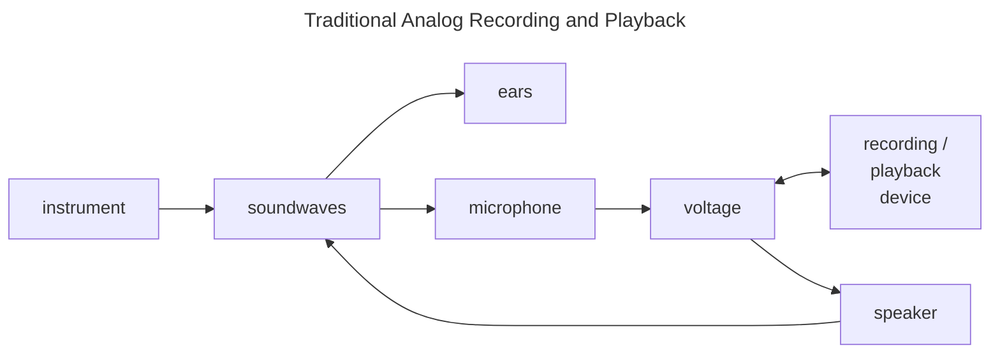
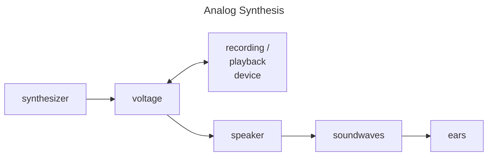
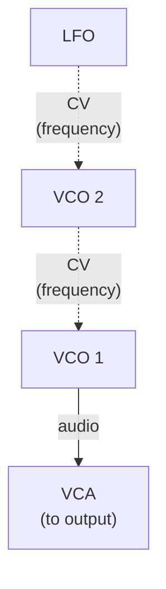

_Copyright &copy; 2024 Kirk Rader_

# Algorithmic Musical Composition

_[This page concentrates primarily on analog synthesizer techniques. See [For
Dennis](./for_dennis.md) for a purely digital example.]_

Go ahead. Press <span style="font-size: xx-large; vertical-align: middle;">&#x23F5;</span>

[Example 04](/mp3/24_Example_04.mp3) <video controls><source src="/24_Example_04.mp4"/></video>

After all, what's the worst that could happen?

## Old-School Modular Analog Synthesis

What humans perceive as sound is the result of rapid changes in air pressure
causing our ear drums to vibrate. So long as these vibrations occur within
certain ranges of _frequency_ and _amplitude_, the arrangement of tiny bones and
sensory nerves within our inner ears transduce them into bioelectric signals
sent to our brains, which process them as recognizable sounds.

A recording of a sound stores a representation of those vibrations in a way such
that they can be transduced into changes in air pressure via a speaker, which
then enter your ears in the same fashion as the original sound. An _analog_
recording represents a stored sound using a continuously varying physical
property where each point in the "analog" of the sound directly matches the
corresponding point in the actual sound. For example, a vinyl disk stores
acoustical vibrations as physical textures on the sides of grooves cut into its
surface. A turntable's playback needle vibrates as a result of brushing against
that texture as the disk spins. The needle's vibrations are converted
electromechanically into a continuously varying voltage. That voltage is passed
through an amplifier and ultimately to the electroacoustic transducer in a
speaker. The speaker's membrane vibrates according to the changes in voltage,
which resonates through the air to listners' ears as a reproduction of the
original sound.

An analog tape stores acoustic vibrations as patterns of intensity of a magnetic
field imparted along its length. Rather than a physically vibrating needle, a
tape machine's playback heads transduce these variations in the magnetic field
to a continuously varying voltage. From that point on, the process is the same
as that described for a turntable. That is why you can connect a turntable and
tape player to a single amplifier, feeding a single set of speakers. Internally,
the "sound" is really just an electrical current whose voltage varies over time
right up until it reaches the speakers.

_[For completeness, a digital recording stores the record of the vibrations as a
series of binary numbers which then undergoes digital to analog conversion
(DAC)... but let's leave that aside for now since we are concentrating here on
analog synthesis and playback.]_

The point to understand for our present purposes is that whatever medium was
used to store a sound, the playback device must be able to transduce the
representation of the stored vibrations into continuous changes to an electric
voltage. That voltage is ultimately sent to a speaker which converts the changes
in voltage to movements of a diaphragm. The vibrating diaphragm causes
corresponding rapid changes in air pressure. The result is that listeners hear a
reproduction of the original sound in the same manner as if they had been
present when it was being recorded, though with a cumulative loss of fidelity
resulting from the physical characteristics of the intermediate transducers and
storage media, governed by basic laws of nature involving constraints like
inertia and entropy.

The process by which such recordings are created is the same, but operating in
reverse. A microphone consists of a membrane which vibrates in resonance to
changes in air pressure. It transduces those vibrations into -- you guessed it!
-- a continuously varying electric voltage. That electric signal is fed into a
device which stores the changes in voltage as changes to whatever recording
medium is in use: vibrations in the cutting needle or. these days, changes to
the position of a cutting laser for a vinyl disk template, changes in intensity
of electromagnets in the recording head of a tape machine, etc.

I.e. to create a recording, a sound is first transformed into a continuously
varying voltage. To play the recording back, the stored analog of the original
sound is again transformed into a voltage:



Analog synthesizers are electronic devices for directly creating audio signals
as continuously varying voltages, suitable for use with audio recording devices,
but where no "real world" source of acoustical vibrations was involved.



Any time a term like _signal_. _signal path_, _audio_ or _audio path_ are used
in the context of a discussion music synthesis, it refers to the continuously
varying voltage representing the analog of an acoustical vibration. (This is to
be distinguished from _control voltage_ (_CV_) or _control path_, discussed
later.)

### Elementary Psychoacoustics

A number of characteristics of sound vibrations combine to form a given sound's
_timbre_: the subjective experience of the sound that allows us, for example, to
distinguish between different musical instruments playing a given note, or tell
the difference betweeen one person's voice and another's. Such characterisics
include:

- The _wave form_ (or "shape") of the vibrations.

- The _frequency_ (or "pitch") of the vibrations.

- The _envelope_ (how the _amplitude_ and wave form change over time).

The terminology of "frequency" and "amplitude" are best explained by reference
to extremely simple wave forms, like sine, rectangle, sawtooth etc. Such wave
are easy to visualize and describe mathematically but rarely occur naturally in
anything close to their pure forms.

Consider the following three tracks displayed in an audio editing program:


The top track contains a 440 Hz sine wave at a particular amplitude. (440 Hz
corresponds to "concert A," the pitch used by players in an orchestra so that
their instruments will all be "in tune" when played together.) Here is what that
track sounds like when played on its own:

**440 Hz Sine Wave** <audio controls><source src="/sine-01.mp3"/></audio>

This is called a "sine wave" because the wave's shape can be exactly represented
by graphing the mathematical _sine_ function. The term "440 Hz" refers to the
fact that this particular sine wave repeats at 440 Hertz, i.e. it traverses one
cycle (from zero to peak to valley and back to zero) 440 times each second.

The second track is the same 440 Hz sine wave, but at half the amplitude. I.e.
it is again a 440 Hz sine wave, but the distance, top to bottom, between the
higest and lowest points in each cycle is half of the corresponding distance in
the preceding track. This results in a tone that sounds exactly the same as the
first one, but at a noticeably lower volume:

**Softer 440 Hz Sine Wave** <audio controls><source src="/sine-02.mp3"/></audio>

The third track is a 880 Hz sine wave, at the same aplitude as the first. The
result is a tone that is the same volume as the first one, but an octave higher
in pitch:

**880 Hz Sine Wave** <audio controls><source src="/sine-03.mp3"/></audio>

Visually, note that the peaks and valleys line up from left to right in the
first two tracks, while the peaks and valleys in the third track are closer
together, i.e. the peaks and valleys occur more frequently as one progresses
through time in the third track compared to the first two. Thus, the third track
represents a higher-frequency wave. Humans perceive higher frequencies as higher
pitches and larger amplitudes as being louder.

Now consider this screen shot from the same audio editing software:


The track depicted contains a sawtooth wave at the same frequency and amplitude
as the first sine wave, above. It sounds like this:

**440 Hz Sawtooth Wave** <audio controls><source src="/sawtooth.mp3"/></audio>

It is perceived as the same "note" as the 440 Hz sine wave, at the same volume
as the first and third of the preceding examples. It has a noticeably different
quality to its sound, however, as if it were being played by a different musical
instrument. Human hearing is such that differently shaped waves are perceived as
sounding distinctively different from one another, even at the same pitch and
amplitude.

The essence of electronic musical composition is finding creative ways to put
all of the preceding principles together.

### Wave Forms As Musical Notes

Any naturally occuring sound will have a fairly complex wave form that can be
understood using the [mathematics of signal
processing](https://en.wikipedia.org/wiki/Fast_Fourier_transform) to be the sum
of a given set of sine waves, each at a specific frequency and amplitude. A
sufficiently chaotic jumble of sine waves at different frequencies and
amplitudes sounds like noise, e.g. the hiss of stean escaping a radiator or the
sound coming from the speakers of an old analog TV that is not tuned to any
station,

In order to sound "musical," the sine waves comprising a given "note" must
conform to certain rules. The loudest (highest amplitude) sine wave should be
the lowest audible frequency present in the sound wave. That is called the
_fundamental_ frequency and will be the note's perceived pitch. Additional sine
waves at perceptible frequencies and amplitudes should occur at frequencies with
specific mathematical relationships to the fundamental frequency. Such
additional frequencies are called _overtones_. One of the things that makes a
violin sound different from a flute and a flute, in turn, different from a
trumpet is the distinctive patterns of overtones at specific amplitudes present
in the sounds they emit.

As a consequence of the physical properties of whatever is producing the sound
-- vocal chords buzzing, sticks or mallets striking drum heads, bows scraping
across strings, etc. -- a sound's wave form and overall amplitude will change
over time in various ways. Percussion instruments, for example, have nearly
instantaneous "attack" and very short "decay." I.e. they are at their loudest
almost from the moment at which their sounds first start, and their loudness
tapers off very quickly. Depending on other physcal characteristcs, such as the
difference between a snare drum and a piano, a percussion instrument might or
might not have any appreciable "release" -- the time it takes for the sound to
die out completely after its initial decay. Drum heads' vibrations damp out to
below audible amplitude nearly as fast as they begin when struck, while a
piano's strings can "ring on" for quite some time if allowed to do so by use of
the sustain pedal. By comparison, human voices as well as wind and string
instruments can have much longer "sustain" levels, determined by the breath
control of the performers or the lengths of their bows. Compared to percussion
instruments, many string and wind instruments have a noticeable "ramp up" in
aoplitude during their attack phase because it takes a little bit of time for
the vibrations to expand to the full length of a given instrument's strings or
air column.

This pattern of _attack - decay - sustain - release_ (_ADSR_) forming a sound's
"envelope" applies to a sound's wave form as well as its amplitude. The
perciptible difference between the timbres of a woodwind and brass instrument,
for example, has mostly to do with differences in their wave forms' envelopes.
This is due to the difference between how their sounds are initially produced. A
woodwind's wave form is relatively constant, even as its amplitude varies, while
a brass instrument's wave form varies considerably from the attack / decay
phases through the sustain / release phases due to the physical characteristics
of human lips compared to the far less elastic media of reeds and wooden or
metallic edges.

In order to produce wave forms with similar complexities to those produced by
"acoustic" instruments, the _modules_ comprising a _modular analog synthesizer_
are individual electronic components that generate or modify an _audio signal_
represented as a continuously varying voltage. By chaining together a number of
such modules in a single audio path, a huge variety of sounds can be produced
using from a few basic building blocks. Since modular synthesizers have
traditionally used patch cords to implement such chains, a given configuration
of modules to produce a particular audio output is referred to as a _patch_.

A typical patch might consist of:

- An _oscillator_, which generates an audio signal in the form of some periodic
  wave form, e.g. sine, triangle, sawtooth or rectangular waves.

- An _amplifier_, which modifies the signal's _gain_, i.e. the audio wave form's
  overall amplitude.

- A _filter_, which allows some audio frequencies to pass through unchanged,
  while attenuating (reducing the amplitude) of other frequencies.

- ...and so on for more exotic types of modules such as _envelope generators_,
  _ring modulators_, _sample and hold units_ etc.


Each type of module accepts input and / or produces output audio signals. It
must also provide controls to set parameters for its operation. For example, an
oscillator may have a physical knob for selecting the wave form to generate and
another knob or slider to control the frequency of its output. In addition, most
modules accept _control voltages_ that can be used to vary such parameters
dynamically as part of an overall patch.

These capabilities together enable a number of approaches to produce wave forms
with more interesting acoustical complexity than simple sine, sawtooth, etc.
waves:

- _Additive synthesis_ uses multiple oscillators to create a fundamental
  together with a series of overtones directly.

- _Subtractive synthesis_ passes an already complex wave form through one or
  more _filters_ set to attenuate particular ranges of frequencies while passing
  other frequencies through without attenuation (or, optionally, boosting the
  amplitude of certain frequencies).

- _Frequency modulation (FM) synthesis_ feeds one or more audio-frequency
  signals into another as control voltages,

FM synthesis is particularly useful with traditional analog synthesizers that
have a relatively small number of oscilattors, each producing relatively simple
wave forms. Such wave forms combine chaotically to produce a lot of acoustically
interesting complexity.

Some producers and performers are primarily interested in electronic instruments
as a means of simulating traditional instrumentation at lower cost than hiring
an orchestra's worth of musicians. Non-modular, typically digital, instruments
are a better choice when all you want are buttons clearly labeled "piano,"
"strings," "horns" etc.

_Electronic Music_, as a meta-genre, is focused on musical techniques, sounds,
and forms that simply are not possible using conventional instruments. Modular
analog synthesizers are ideal for such pursuits.

## Using Control Voltages

### Traditional Musical Techniques

A _low frequency oscillator (LFO)_ is simply a VCO (voltage controlled
oscillator) which is configured to emit a frequency well below that which is
perceptible to human hearing. Such a LFO is often used for traditional musical
techniques involving changes to tempo, like _rubato_ or pitch, like _vibrato_.


For example, here is the audio output of a VCO emitting a sine wave at a given
base pitch, with another sine wave emitted by a LFO patched into the VCO's CV
controlling the latter's frequency:

**Vibrato** <audio controls><source src="/vibrato.mp3" /></audio>

The result is that the VCO's output continously increases and decreases in
pitch, producing vibrato.

### Uniquely Electronic Techniques

As with other aspects of electronic musical composition, analog modular
syntheisizers allows far greater scope for defining musical techniques than is
possible with traditional instruments. For example, here is a similar example to
the preceding one, but with the range of frequencies in the "vibrator" far
beyond what a human could achieve with a traditional instrument:

**Way Beyond "Vibrato"** <audio controls><source src="/extreme_vibrato.mp3" /></audio>

Taking it one step further, here is an extremely simple example of what is
npossible using FM synthsis. Like the preceding example, it is the output of a
VCO emitting a sine wave. In this case, however, the first VCO's frequency is
being modulated by feeding the output of a second sine wave, whose base
frequency is tuned to the same frequency as the source of the audio signal, into
the first VCO's CV input controlling its frequency. I.e. the audio signal is the
result of modulating a sine wave's frequency by another sine wave. If that were
the end of it, there would be relatively little change to the output signal
because the two sines waves were tuned to the same initial frequency. However,
for this patch, the second sine wave's frequency is itself being modulated by a
third, low frequency sine wave, creating a continuously varying interference
pattern between the first two VCO's frequencies:



**Sine vs Sine vs Sine**<audio controls><source src="/fm.mp3" /></audio>

## Example 01

It is obviously a matter of taste as to how "musical" any of the preceding
examples sound.

Here is a composition that combines all of the preceding principles, using a
Behringer 2600 semi-modular synthesizer, to produce polyrhytmuc music with
harmonic and timbral structures not achievable using conventional instruments:

[Example 01](/mp3/21_Example_01.mp3) <audio controls><source src="/mp3/21_Example_01.mp3" /></audio>


[Example 01](/mp3/21_Example_01.mp3) consists of three tracks of a couple of
minutes each, recorded with VCO 1's _Fine Tune_ slider set to the extreme right,
middle and extreme left, respectively.


## Example 02

[Example 02](/mp3/22_Example_02.mp3) <audio controls><source src="/mp3/22_Example_02.mp3" /></audio>

## Example 03

[Example 03](/mp3/23_Example_03.mp3) <audio controls><source src="/mp3/23_Example_03.mp3" /></audio>

**Meloday Patch** 

**Toms Patch** 

```ruby
# Copyright 2024 Kirk Rader

# Example 03

use_random_seed 10
use_random_source :white

terminate = false

# master clock
in_thread do
  with_bpm 120 do
    midi (hz_to_midi 440)
    sleep 10
    180.times do
      cue :master
      sleep 1
    end
  ensure
    terminate = true
    cue :master
    sleep 1
    midi_all_notes_off
  end
end

# track 1 (low toms hard)
comment do
  in_thread do
    with_bpm 120 do
      beats = (spread 2, 5).rotate(2)
      loop do
        sync :master
        stop if terminate
        tick
        midi 36 if beats.look
      end
    ensure
      midi 36
      sleep 1
    end
  end
end

# track 2 (low toms soft)
comment do
  in_thread do
    with_bpm 120 do
      beats = (spread 2, 5).rotate(2)
      loop do
        sync :master
        stop if terminate
        tick
        midi 36 if !beats.look
      end
    end
  end
end

# track 3 (high toms hard)
comment do
  in_thread do
    with_bpm 120 do
      beats = (spread 3, 7).rotate(1)
      loop do
        sync :master
        stop if terminate
        tick
        midi 48 if beats.look
      end
    end
  end
end

# track 4 (high toms soft)
comment do
  in_thread do
    with_bpm 120 do
      beats = (spread 3, 7).rotate(1)
      loop do
        sync :master
        stop if terminate
        tick
        midi 48 if !beats.look
      end
    end
  end
end

# track 5 (bass)
comment do
  in_thread do
    with_bpm 120 do
      notes = (range 20, 31).shuffle
      loop do
        sync :master
        stop if terminate
        tick
        midi notes.look
      end
    ensure
      midi 20
      sleep 1
    end
  end
end

# track 6 (baritone)
uncomment do
  in_thread do
    with_bpm 120 do
      notes = (range 37, 48).shuffle
      loop do
        sync :master
        stop if terminate
        tick
        midi notes.look
      end
    ensure
      midi 48
      sleep 1
    end
  end
end
```

## Summary

Other than [Example 03](#example-03), which was created using a Ruby program
executed by [Sonic Pi](https://sonic-pi.net), you might be asking yourself,
"wasn't this whole page supposed to be about _algorithmic_ componsition? Where
are all the algorithms?"

The answer, of course, is "the patches _are_ the algorithms."

It is worth noting that not one of the examples on this page involved the use of
a keyboard nor any other direct input medium. None of them were "played" in the
conventional sense. The _Sonic Pi_ program sent commands to the synthesizer as
MIDI events, but the timing and note values of those MIDI events were entirely
determined by the execution of the Ruby program shown above. For the other
examples, any rhythms, dynamics or other time-based aspects were the result of
the "logic" of how various wave forms combined along both the audio and control
paths of a given patch. (Most of these examples, as well as my published works,
are composites of multiple tracks arranged manually using _digital audio
workstation_ (DAW) software, but most such tracks in my body of work were
created in this entirely algorithmic fashion.)

A traditional musical score is an algorithm, expressed in the language of
traditional muscial notation. Such algorithms are intended to be executed by the
human performers who play the music encoded by the given score. Such algorithms
are, however, more like recipes in a cookbook than like mathematical formulas.
I.e. the choice of each and every "ingredient" and how they are combined in a
conventional musical score is the result of a conscious decision by its
composer, resulting from that particular person's whims and tastes at the time
of composition.

Similarly, the source code that was used to drive [Example 03](#example-03) is
an algorithm expressed in the Ruby programming language, executed by a computer
running _Sonic Pi_. I.e. the Ruby code is the musical score for _Example 03_
every bit as much, and exactly the same way as a score written in musical
notation. Though it looks nothing like music notation, each line was consciously
and deliberately written by a person (your humble author) according to a
particular set of transitory "artistic" impulses with the aim of achieving some
particular esthetic result.

For the other examples on this page (and many of my published musical
compositions), the algorithm is embodied directly in how the modules of various
analog synthesizers are configured and patched together. They are, in effect,
algorithms that execute themselves. This is the key concept which, in the late
1970's, simultaneously drew me toward this style of electronic music composition
and toward computer programming as a career.

I had already fallen in love with the sound of electronic music when I began
studying symbolic logic and formal linguistics at UCLA in 1978 (including
seminars on various topics in metamathematics conducted by [Alonzo
Church](https://plato.stanford.edu/ENTRIES/church/), himself.) At the same time,
I started dabbling in the creation of my own electronic musical compositions, I
was immediately struck by how the third of the following bullet points is a
direct consequence (actually, a restatement in applied terms) of the first two
foundational principles of computational logic:

- Any possible algorithm can be expressed as a formula of Church's
  [&lambda;-calculus](https://en.wikipedia.org/wiki/Lambda_calculus).

- Any well-formed formula of the &lambda;-calculus can be "embodied" as one of
  Turing's [a-machines](https://en.wikipedia.org/wiki/Turing_machine).

- _Thus, any possible musical composition could, in principle, be embodied in an
  analog synthesizer patch given a sufficient number of the correct kinds of
  modules.<a href="#undecidable"><sup>*</sup></a>_

That said, I never felt any great need to reproduce traditional musical sounds
or forms by electronic means. (I occasionally do so, but usually only as
experiments with particular tools or techniques, i.e. as "studies" for more
purely electronic compositions.) Specifically, I consider traditional music
notation and instrumentation entirely sufficent for expressing traditional
musical ideas. My passion as a composer is in exploring musical ideas which
cannot be expressed or performed by traditional means. This is no less an
"artistic" undertaking than composing and arranging more conventional music. It
is just that the artistry occurs by way of experimenting with patches, reording
the results, and layering the individual tracks in a final mix for any given
piece.

---

<a id="undecidable"><sup>*</sup></a><i>Undecidable</i>

The title and cover art of my first album, _Undecidable_ (consisting of tracks I
recorded in the late 1970's through the early 1980's) are testaments to the
conceptual origin of my musical style. Its "logo" is the following expression of
the &lambda;-calculus:

$$
\begin{align*}
    \text{Let } \Omega &= \omega \ \omega \\
  \text{where } \omega &= \lambda x.x \ x
\end{align*}
$$

&omega; is a function which calls itself indefinitely, meaning that &Omega; will
never receive any definite value within a finite amount of time. Such
self-recursion resulting in an infinitely evolving outcome is analogous to using
techniques like FM synthesis, which mix together elements between the audio and
control paths of a patch to achieve complex sonic outputs from mutually
referential inputs.
