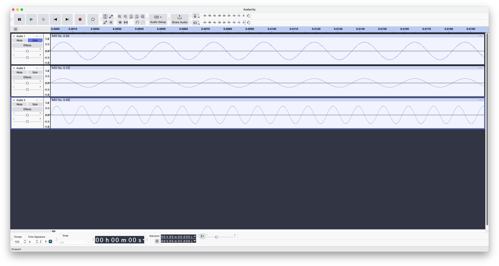
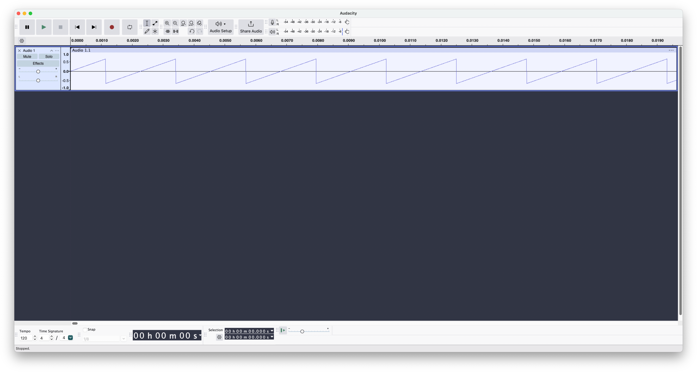
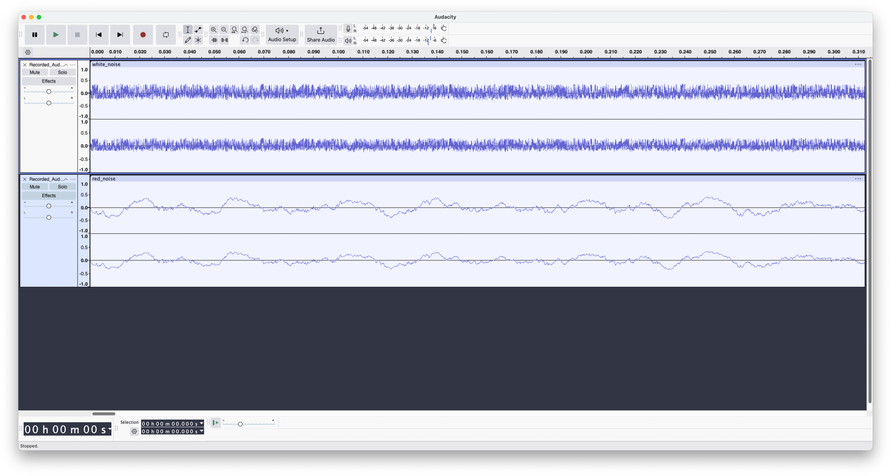
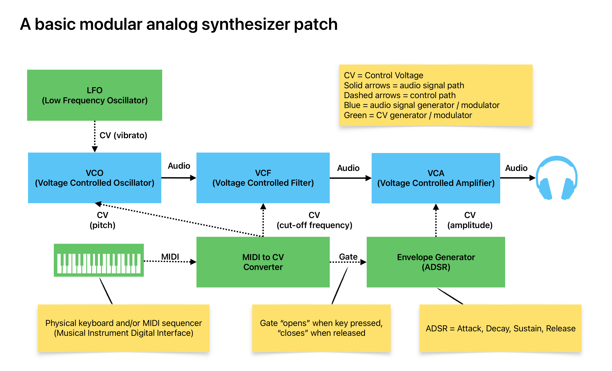
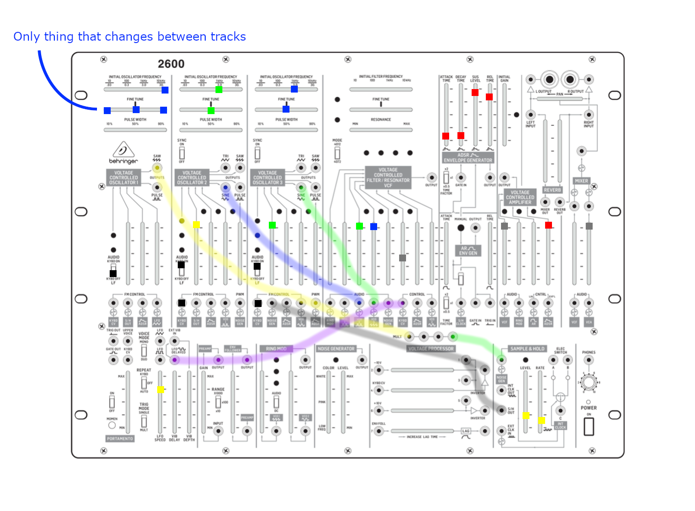
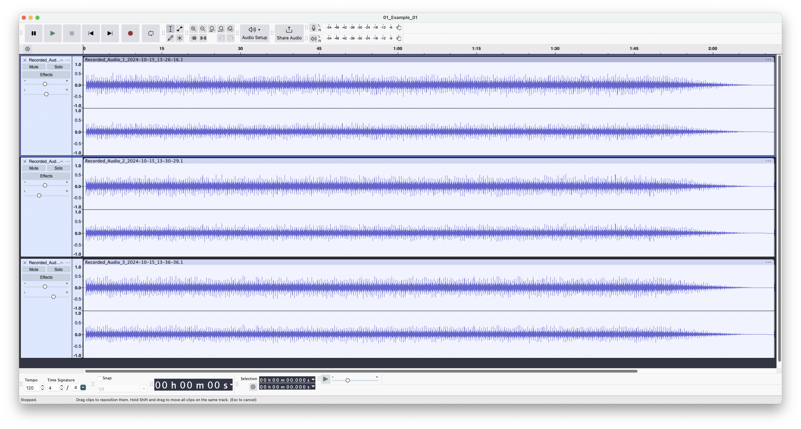
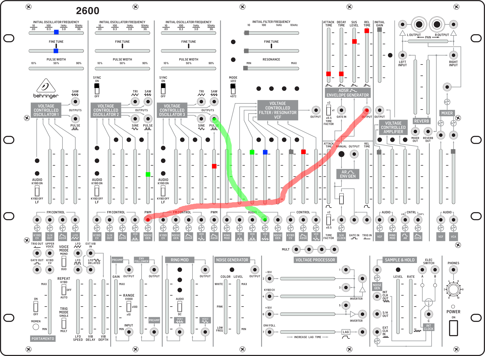
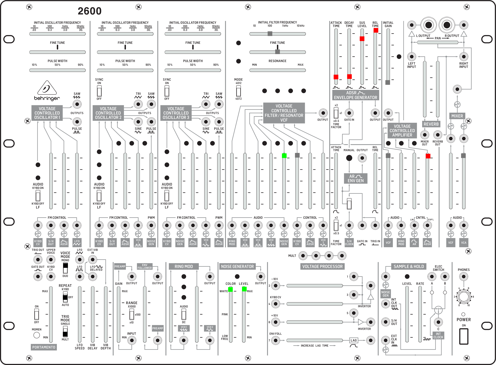

_Copyright &copy; 2024 Kirk Rader_

# Algorithmic Musical Composition

_[This page concentrates primarily on analog synthesizer techniques. See [For
Dennis](../for_dennis/) for a purely digital example.]_

Go ahead. Press <span style="font-size: xx-large; vertical-align: middle;">&#x23F5;</span>

<video controls>
    <source src="./mp4/Example_04.mp4"/>
</video>

After all, what's the worst that could happen?

What humans perceive as sound is the result of rapid changes in air pressure
causing our ear drums to vibrate. So long as these vibrations occur within
certain ranges of _frequency_ and _amplitude_, the arrangement of tiny bones and
sensory nerves within our inner ears transduce them into bioelectric signals
sent to our brains, which process and interpret them as recognizable sounds.

Such changes in air pressure are conventionally visualized and described
mathematically by analogy to ripples on a still body of water when something
disturbs its surface. In this analogy, striking a drum's head is like tossing a
pebble into a pond on a windless day. The mass of the stone displaces some
amount of fluid as it passes through the water, causing a characteristic pattern
of changes to the water's pressure. When those pressure changes reach the pond's
surface, they appear as ripples emanating from the point at which the pebble
entered the water. The ripples have a distinctive shape that is caused by the
interplay of the size, shape and mass of the pebble, the density and viscosity
of the water, the size and shape of the pond, and so on. The ripples are tallest
when the pebble first enters the water, then become lower over time as the
energy from the impact dissipates. Eventually the system returns to equilibrium.
The water again has a smooth, motionless surface until the next pebble is
thrown. If multiple pebbles are thrown when the ripples from previous pebbles
have not yet died out, the pond's surface is covered by complex patterns of
ripples, where the motion of one ripple might either reinforce or cancel out the
motion of some other ripple.

In the case of sound waves caused by striking a drum, the drumstick or mallet is
like the pebble, the drumhead is like the pond's surface. Striking the drum
causes ripples on the surface of the drum. The size and shape of the ripples are
determined by factors such as the elasticity of the drumhead and its taughtness.
Other factors include the size and shape of the body of the drum, the physical
characteristics of the object used to strike it, and so on. The height and shape
of the ripples in the drumhead cause a corresponding pattern of changes to
pressure in the surrounding air. The eardrums of anyone in hearing range then
are induced to ripple in sympathy to the ripples in the drumhead due to those
changes in air pressure. (Hence the antique term _sympathetic vibrations_ as a
way of describing how _resonance_ works.) This is why sounds are described by
acousticians and recording engineers using the terminology of _sound waves_ and
_wave forms_. Since any wave form can be depicted by graphing some mathematical
function, it is common to visualize sound waves using such graphs and to
describe them using mathematical terms like _sine wave_.

A recording of a sound stores a representation of the sound waves in a way such
that they can be transduced into changes in air pressure via a speaker, which
then enter our ears in the same fashion as the original sound. An _analog_
recording represents a stored sound using a continuously varying physical
property where each point in the "analog" of the sound directly matches the
corresponding point in the original sound's wave form.

For example, a vinyl disk stores acoustical vibrations as physical textures on
the sides of grooves cut into its surface. A turntable's playback needle
vibrates as a result of brushing against that texture as the disk spins. The
needle's vibrations are converted electromechanically into a continuously
varying voltage. That voltage is passed through an amplifier and ultimately to
the electroacoustic transducer in a speaker. The speaker's membrane vibrates
according to the changes in voltage, which resonates through the air to
listeners' ears as a reproduction of the original sound.

In the same way, an analog tape stores acoustic vibrations as patterns of
intensity of a magnetic field imparted along its length. Rather than a
physically vibrating needle, a tape machine's playback heads transduce these
variations in the magnetic field to a continuously varying voltage. From that
point on, the process is the same as that described for a turntable. That is why
you can connect a turntable and tape player to a single amplifier, feeding a
single set of speakers. Internally, the "sound" is really just an electrical
current whose voltage varies over time in "sympathy" to the recorded sound
waves, right up until it reaches the speakers, where they are converted back
into actual sound waves.

_[For completeness, a digital recording stores the record of the vibrations as a
series of binary numbers which then undergoes digital to analog conversion (DAC)
to become an audio signal conveyed as a varying voltage... but let's leave that
aside for now since we are concentrating here on analog synthesis and
playback.]_

The point to understand for our present purposes is that whatever medium was
used to store a sound, the playback device must be able to transduce the
representation of the stored vibrations into continuous changes to an electric
voltage. That voltage is ultimately sent to a speaker which converts the changes
in voltage to movements of a diaphragm. The vibrating diaphragm causes
corresponding rapid changes in air pressure. The result is that listeners hear a
reproduction of the original sound in the same manner as if they had been
present when it was being recorded, though with a cumulative loss of fidelity
resulting from the physical characteristics of the intermediate transducers and
storage media, governed by basic laws of nature involving constraints like
friction, inertia, and entropy.

The process by which such recordings are created is the same, but operating in
reverse. A microphone consists of a membrane which vibrates in resonance to
changes in air pressure, just like a person's eardrums vibrate in resonance to
sound waves. The microphone transduces those vibrations into -- you guessed it!
-- a continuously varying electric voltage. That electric signal is fed into a
device which stores the changes in voltage as changes to whatever recording
medium is in use: vibrations in the cutting needle for a vinyl disk template,
changes in intensity of electromagnets in the recording head of a tape machine,
etc.

I.e. to create a recording, a sound is first transformed into a continuously
varying voltage which is then used to create some physical analog of the
original sound waves. To play the recording back, the stored analog of the
original sound is again transformed into a voltage:

```mermaid
---
title: Traditional Analog Recording and Playback
---
graph LR

    recorder[recording /<br>playback<br>device]

    soundwaves --> ears
    instrument --> soundwaves
    soundwaves --> microphone
    microphone --> voltage
    voltage <--> recorder
    voltage --> speaker
    speaker --> soundwaves
```

Analog synthesizers are electronic devices for directly creating audio signals
as continuously varying voltages, suitable for use with audio recording devices,
but where no "real world" source of acoustical vibrations was involved.

```mermaid
---
title: Analog Synthesis
---
graph LR

    recorder[recording /<br>playback<br>device]

    synthesizer --> voltage
    voltage <--> recorder
    voltage --> speaker
    speaker --> soundwaves
    soundwaves --> ears
```

Any time a term like _signal_. _signal path_, _audio_ or _audio path_ are used
in the context of music synthesis, it refers to the continuously varying voltage
representing the analog of an acoustical vibration. This is to be distinguished
from _control voltage_ (_CV_) or _control path_, discussed later.

## Elementary Psychoacoustics

A number of characteristics of sound vibrations combine to form a given sound's
_timbre_: the subjective experience of the sound that allows us, for example, to
distinguish between different musical instruments playing a given note, or tell
the difference betweeen one person's voice and another's. Such characterisics
include:

- The _wave form_ (or "shape") of the vibrations.

- The _frequency_ (or "pitch") of the vibrations.

- A vibration's _envelope_ (how the _amplitude_ and wave form change over time).

The terminology of "frequency" and "amplitude" are best explained by reference
to extremely simple wave forms, like sine, rectangle, sawtooth etc. Such wave
forms are easy to visualize and describe mathematically but rarely occur
naturally in anything close to their pure forms.

Consider the following three tracks displayed in an audio editing program:



The top track contains a 440 Hz sine wave at a particular amplitude (440 Hz
corresponds to "concert A," the pitch used by players in an orchestra so that
their instruments will all be "in tune" when played together). Here is what that
track sounds like when played on its own:

**440 Hz Sine Wave** <audio controls><source src="./mp3/sine-01.mp3"/></audio>

This is called a "sine wave" because the wave's shape can be exactly represented
by graphing the mathematical _sine_ function:

$$
v = a \sin(pt)
$$

where $t$ is a point in time, $p$ and $a$ are scaling factors representing the
tone's pitch and amplitude, respectively, and $v$ the audio signal's voltage at
that time.

The term "440 Hz" refers to the fact that this particular sine wave repeats at
440 Hertz, i.e. it traverses one cycle (from zero volts, to peak, to valley and
back to zero) 440 times each second.

The second track is the same 440 Hz sine wave, but at half the amplitude. I.e.
it is again a 440 Hz sine wave, but the distance, top to bottom, between the
higest and lowest points in each cycle is half of the corresponding distance in
the preceding track. This results in a tone that sounds exactly the same as the
first one, but at a noticeably lower volume:

**Softer 440 Hz Sine Wave** <audio controls><source src="./mp3/sine-02.mp3"/></audio>

The third track is a 880 Hz sine wave, at the same amplitude as the first. The
result is a tone that is the same volume as the first one, but an octave higher
in pitch:

**880 Hz Sine Wave** <audio controls><source src="./mp3/sine-03.mp3"/></audio>

Visually, note that the peaks and valleys line up from left to right in the
first two tracks, while the peaks and valleys in the third track are closer
together, i.e. the peaks and valleys occur more frequently as one progresses
through time in the third track compared to the first two. Thus, the third track
represents a higher-frequency wave. Humans perceive higher frequencies as higher
pitches and larger amplitudes as being louder. The keys on a "tempered"
instrument like a piano or organ each correspond to a particular pitch in
conventional musical notation. For example, striking the A key immediately above
middle C causes a properly tuned piano's corresponding string to vibrate at 440
Hz, the frequency of the first two of the preceding sine waves.

Now consider this screen shot from the same audio editing software:



The track depicted contains a sawtooth wave at the same frequency and amplitude
as the first sine wave, above. It sounds like this:

**440 Hz Sawtooth Wave** <audio controls><source src="./mp3/sawtooth.mp3"/></audio>

It is perceived as being the same pitch as the 440 Hz sine wave. It has a
noticeably different quality to its sound, however, as if it were being played
by a different musical instrument -- e.g. like the difference between a flute
and oboe. Human hearing is such that differently shaped waves are perceived as
sounding distinctively different from one another, even at the same pitch and
amplitude. Note also that even though the sawtooth wave has the same overall
amplitude when graphed as the first sine wave, above, it actually sounds a bit
louder when played back. This is due to the presence of _overtones_, discussed
later.

The essence of electronic musical composition is finding creative ways to put
all of the preceding principles together.

## Wave Forms As Musical Notes

### Composite Wave Forms (Fundamentals vs Overtones)

Any naturally occuring sound will have a fairly complex wave form that can be
understood using the [mathematics of signal
processing](https://en.wikipedia.org/wiki/Fast_Fourier_transform) to be the sum
of a particular set of sine waves, each at a specific frequency and amplitude. A
sufficiently chaotic jumble of sine waves at different frequencies and
amplitudes sounds like noise, e.g. the hiss of steam escaping a radiator or the
sound coming from the speakers of an old analog TV that is not tuned to any
station. A truly random distribution of frequencies across the full range of
audible frequenices is referred to as "white" noise, by analogy to the colors in
the visible light spectrum:

**White Noise** <audio controls><source src="./mp3/white_noise.mp3"/></audio>

Noise that contains a preponderance of frequencies lower in the audible
"spectrum" is referred to as "pink" or "red," again by analogy to light colors.
White light that is passed through a filter than only allows lower frequencies
to pass through becomes pink or red depending on the filter's cut-off frequency.
By analogy, "white" noise that is passed through a low-pass filter will sound
"redder":

**Red Noise** <audio controls><source src="./mp3/red_noise.mp3"/></audio>

Here is what the preceding two wave forms look like in an audio editing program:



Note that the preceding sound wave graphs both consist of a randomly varying
signal voltage with the same overall amplitude. The white noise graph varies
faster over time than the graph of red noise, because it contains more
frequencies in any given span of time. Because the white noise contains more
frequencies per unit of time, it sounds louder than the red noise for the same
reason that the sawtooth wave, above, sounds louder than the corresponding sine
wave. Even though noise is not particuarly "musical" on its own (it is, after
all, called "noise" for a reason) it does find its way into many analog
synthesizer setups for a variety of purposes, as will be seen later.

In order to sound "musical," the sine waves comprising a given "note" must
conform to certain rules. The loudest (highest amplitude) sine wave should be
the lowest audible frequency present in the sound wave. That is called the
_fundamental_ frequency and will be the note's perceived pitch. Additional sine
waves at perceptible frequencies and amplitudes should occur at frequencies with
specific mathematical relationships to the fundamental frequency. Such
additional frequencies are called _overtones_. One of the things that makes a
violin sound different from a flute and a flute, in turn, different from a
trumpet is the distinctive patterns of overtones at specific amplitudes present
in the sounds they emit. A sine wave consists of nothing but its fundamental,
while any other wave form consists of a fundamental plus some number of
overtones. White noise sounds louder than red noise, and a sawtooth wave sounds
louder than a sine wave because, in each case, the former represents a greater
transfer of energy from sound waves to ear drums compared to the latter in the
form of changes in air pressure due to the inclusion of more frequencies per
unit of time.

### Dynamic Properties of Musical Notes

As a consequence of the physical properties of whatever is producing a sound --
vocal chords buzzing, sticks or mallets striking drum heads, bows scraping
across strings, etc. -- a sound's wave form and overall amplitude will change
over time in various ways. Consider what happens when a stick strikes a drum.

First, the stick imparts energy to the drumhead at the point at which it lands.
How much energy is determined by the stick's mass and velocity as determined by
Newton's laws of motion. The energy absorbed by the drumhead causes waves to run
through it similar to the ripples on the surface of a pond caused by tossing a
stone. Those ripples are tallest when the stick first strikes, but quickly die
out as their energy dissipates throughout the material of which the drumhead is
made. We hear a short burst of sound, as these very short-lived waves resonant
to our eardrums through the air.

A bowed string instrument works very differently, even though it is subject to
the same laws of physics as a drum. The friction between the bow and the string
causes the string to vibrate at a frequency that is determined by a combination
of factors including the string's elasticity, length and taughtness. The
strength of the vibrations -- i.e. the amplitude of the wave form it produces --
are determined by the amount of energy imparted by the bow, which is affected by
the speed at which it is moving and the amount of pressure applied. Again thanks
to classical physics, the string's own inertia means that it takes a bit of time
for the vibrations to emanate from the point at which the bow makes contact and
reach maximum amplitude along its entire length. This causes a small but
noticeable "ramping up" of the volume of the note when the bow is first applied.
But as long as the bow keeps moving against it, the string keeps receiving
energy and so keeps vibrating. Because of the lower mass and air resistance at
each point on a string compared to an extended surface like a drumhead, a
string's vibrations take longer to die out after the bow is removed, unless they
are mechanically surpressed. (The latter is how string players achieve staccato:
they keep the bow pressed against the string to damp its vibrations more quickly
than when they end a note by removing the bow from the string entirely.)

And so on for plucked string instruments, brass and woodwinds. The materials of
which they are constructed and the manner in which they generate sound are, on
the one hand, all governed by the same simple laws of physics but with results
that sound different due to each instrument's particular mechanical properties.
Among the factors that give each instrument its own unique timbre is the rate at
which their amplitude ramps up and dies out and the way their sound waves'
shapes changes over time as a note is played. These changes of a note's sound
over time is called _envelope_.

For the purposes of understanding how musical sounds are perceived, it turns out
that envelope can be broken down into four distinct phases:

| Phase     | Description                                                                                              |
|-----------|----------------------------------------------------------------------------------------------------------|
| _Attack_  | The time from which energy is first applied to when it reaches its maximum                               |
| _Decay_   | The time from when energy has reeached its maximum to when it reaches the level at which it is sustained |
| _Sustain_ | The amount of energy continously applied while a note is being played                                    |
| _Release_ | The time it takes for the energy to die out after it is no longer being sustained                        |

Drums, for example, have nearly instantaneous attack and very short decay. I.e.
they are at their loudest almost from the instant at which their sounds first
start, and their loudness tapers off just as quickly. Depending on various
physcal characteristcs, such as the differences between the construction and
operation of a snare drum and a cymbal or piano, a percussion instrument might
or might not have any appreciable release -- the time it takes for the sound to
die out completely after its initial decay. Drum heads' vibrations damp out to
below audible amplitude nearly as fast as they begin when struck, while a
piano's strings can "ring on" for quite some time if allowed to do so by use of
the sustain pedal. Either way, the defining characteristic of a percussion
instrument is that it has no true sustain (despite the name of a piano's pedal).
By comparison, human voices as well as wind and bowed instruments can have
appreciable sustain levels, determined by the breath control of the performers
or the lengths of their bows.

That said, bowed and wind instruments can have a noticeable "ramp up" in
amplitude during their attack phase compared to plucked or percussion
instruments, because it takes a little bit of time for sufficient energy to be
transferred to the full length of a given instrument's strings or air column,
depending on the mechanical properties of the means by which that energy is
imparted to begin with.

This pattern of _attack - decay - sustain - release_ (_ADSR_) forming a sound's
envelope applies to a sound's wave form as well as its amplitude. The
perceptible difference between the timbres of a woodwind and brass instrument,
for example, has a lot to do with differences in their wave forms' envelopes
even though their amplitude envelopes are quite similar. This is due to the
difference between how their sounds are initially produced. A woodwind's wave
form is relatively constant, even as its amplitude varies, while a brass
instrument's wave form varies considerably from the attack / decay phases
through the sustain / release phases due to the physical characteristics of
human lips vibrating against each other while pressed to a mouthpiece compared
to the far less elastic media of reeds and wooden or metallic edges while air is
blown against them.

## Old-School Modular Analog Synthesis

In order to produce wave forms with similar musical characteristics and
complexities to those produced by "acoustic" instruments, the _modules_
comprising a _modular analog synthesizer_ are individual electronic components
that generate or modify an _audio signal_ represented as a continuously varying
voltage. By chaining together a number of such modules in a single audio path, a
huge variety of wave forms can be produced from a few basic building blocks.
Since modular synthesizers have traditionally used patch cords to implement such
chains of modules, a given configuration of modules to produce a particular
audio output is referred to as a _patch_.

A typical patch might consist of:

- One or more _oscillators_, which generate audio signals in the form of some
  periodic wave form, e.g. sine, triangle, sawtooth or rectangular waves.

- One or more _filters_, which allow some audio frequencies to pass through
  unchanged, while attenuating (reducing the amplitude) of other frequencies.

- An _amplifier_, which modifies the signal's _gain_, i.e. the audio wave form's
  overall amplitude.

- ...and so on for more exotic types of modules such as _envelope generators_,
  _ring modulators_, _sample and hold units_ etc.



Each type of module accepts input and / or produces output audio signals. It
must also provide controls to set parameters for its operation. For example, an
oscillator may have a physical knob for selecting the wave form to generate and
another knob or slider to control the frequency of its output. In addition, most
modules accept _control voltages_ that can be used to vary such parameters
dynamically as part of an overall patch.

These capabilities together enable a number of approaches to produce wave forms
with more interesting acoustical complexity than simple sine, sawtooth, etc.
waves:

- _Additive synthesis_ uses multiple oscillators to create a fundamental
  together with a series of overtones directly.

- _Subtractive synthesis_ passes an already complex wave form through one or
  more filters set to attenuate particular ranges of frequencies while passing
  other frequencies through without attenuation (or, optionally, boosting the
  amplitude of certain frequencies).

- _Frequency modulation (FM) synthesis_ feeds one or more audio-frequency
  signals into another as control voltages.

FM synthesis is particularly useful with traditional analog synthesizers that
have a relatively small number of oscilattors, each producing relatively simple
wave forms. Such wave forms combine through FM synthesis chaotically, which
produces a lot of acoustically interesting complexity from relatively few
individual oscillators.

Some producers and performers are primarily interested in electronic instruments
as a means of simulating traditional instrumentation at lower cost than hiring
an orchestra's worth of musicians. Non-modular, typically digital, instruments
are a better choice when all you want are buttons clearly labeled "piano,"
"strings," "horns" etc.

_Electronic Music_, as a meta-genre, is focused on musical techniques, timbres,
and forms that simply are not possible using conventional instruments. Modular
analog synthesizers are ideal for such pursuits.

### Using Control Voltages

#### Traditional Musical Techniques

A _low frequency oscillator (LFO)_ is simply a VCO (voltage controlled
oscillator) which is configured to emit a frequency well below that which is
perceptible to human hearing. Such a LFO is often used for traditional musical
techniques involving changes to pitch, like _vibrato_, or tempo, like _rubato_.

For example, here is the audio output of a VCO emitting a sine wave at a given
base pitch, with another sine wave emitted by a LFO patched into the VCO's CV
controlling the former's frequency:

**Vibrato** <audio controls><source src="./mp3/vibrato.mp3" /></audio>

The result is that the VCO's output continously increases and decreases in
pitch, producing vibrato from a patch like:

```mermaid
graph LR

    LFO -.->|"CV<br>(frequency)"| VCO
    VCO -->|audio| VCA
```

#### Uniquely Electronic Techniques

As with other aspects of electronic musical composition, analog modular
synthesizers allow far greater scope for defining musical techniques than is
possible with traditional instruments. For a very basic example, here is the
output of the same patch as the preceding one, but with a far larger CV
amplitude. The range of frequencies in the resulting "vibrato" is far beyond
what a human could achieve with a traditional instrument:

**Way Beyond "Vibrato"** <audio controls><source src="./mp3/extreme_vibrato.mp3" /></audio>

And here is an extremely simple example of what is npossible using FM synthsis.
Like the preceding example, it is the output of a VCO emitting a sine wave. In
this case, however, the first VCO's frequency is being modulated by feeding the
output of a second sine wave, whose base frequency is tuned to the same
frequency as the source of the audio signal, into the first VCO's CV input
controlling its frequency. I.e. the audio signal is the result of modulating a
sine wave's frequency by another sine wave. If that were the end of it, there
would be relatively little change to the output timbre because the two sines
waves were tuned to the same initial frequency. However, for this patch, the
second sine wave's frequency is itself being modulated by a third, low frequency
sine wave, creating a continuously varying interference pattern between the
first two VCO's frequencies:

```mermaid
graph LR

    lfo[LFO]
    vco1[VCO 1]
    vco2[VCO 2]
    vca["VCA<br>(to output)"]

    lfo .->|"CV<br>(frequency)"| vco2
    vco2 .->|"CV<br>(frequency)"| vco1
    vco1 -->|audio| vca
```

**Sine vs Sine vs Sine**<audio controls><source src="./mp3/fm.mp3" /></audio>

On the one hand, the preceding sounds likes a continuously sustained note whose
pitch is that of the constant fundamental frequency to which VCO 1 is tuned.
Over time, however, the timbre changes continuously in a repeating pattern due
to the overtones introduced by modulating VCO 1 using VCO 2 and varying VCO 2's
frequency by way of the LFO. The speed of the sweep of changing overtones is
determined by the frequency of the LFO.

As already discussed, a sound's envelope is an essential aspect of its timbre.
An _ADSR envelope generator_ is a type of module that emits a pattern of changes
to a control voltage each time it is triggered by receipt of _gate singals_.
"ADSR" is an acronym for _Attack_, _Decary_, _Sustain_, _Release_. An ADSR unit
provides controls (e.g. knobs or sliders) to set values for each phase. In
analog synthesizers, "acoustical energy" is represented in a patch as the value
of a control voltage. Here is the same table as shown
[above](#dynamic-properties-of-musical-notes), as it applies to the modules
comprising a patch:

| Envelope Phase | Description                                                                                     |
|----------------|-------------------------------------------------------------------------------------------------|
| _Attack_       | Time it takes for CV to go from 0 to its maximum value when the gate "open" signal is received  |
| _Decay_        | Time it takes for CV to go from its maximum value to the sustain level                          |
| _Sustain_      | Level at which CV remains after attack and decay phases, for as long as the gate remains "open" |
| _Release_      | Time it takes for CV to go from its current level to 0 when the gate "close" signal is received |

The gate signals are often provided by keyboard events: the gate "opens" when a
key is pressed and "closes" when the key is released. However, other triggers
can be used as the gate signals for ADSR. Many of the my compositions "play
themselves" by using a single "clock" signal to drive both _envelope generator_
and _sample and hold_ units simultaneously, where a _sample and hold_ unit emits
a control voltage based on periodically "sampling" an input voltage and
"holding" its output at that level until it is time for the next "sample."

To illustrate, consider a patch like:

```mermaid
graph LR

    LFO -.->|"CV<br>(sawtooth)"| VCO
    VCO -->|audio| VCA
```

The preceding will produce a sound like:

**Smoothly ramping pitch** <audio controls><source src="./mp3/smooth.mp3"/></audio>

because the low-frequency sawtooth wave causes the frequency of the tone emitted
by the VCO to continuously increase from its minimum value to its maximum value
for each cycle of the control signal.

Adding a sample and hold (S&H) unit to the patch:

```mermaid
graph LR

    sh["S&H"]

    LFO -.->|"CV<br>(sawtooth)"| sh
    clock -.-> sh
    sh -.->|"CV"| VCO
    VCO -->|audio| VCA
```

will cause the output to sound something like:

**Stair stepping pitch** <audio controls><source src="./mp3/s_h_1.mp3"/></audio>

The output jumps directly from pitch to pitch instead of sliding continuously
higher because the S&H unit sets its output voltage to whatever is present on
its input each time the clock "ticks." The S&H unit holds its output at that
level until the next "tick," when it again sets its output voltage to match its
input at that instant in time. The smoothly ramping sawtooth wave is turned into
a stair case. The width and height of the steps are determined by the
relationship between the frequency and amplitude of the sampled voltage, the
low-frequency sawtooth in this case, and the speed of the clock. For example,
here is what the same patch sounds like sampling the same sawtooth but with the
clock frequency sped up a bit:

**Faster clock** <audio controls><source src="./mp3/s_h_2.mp3"/></audio>

Note that the output traverses the same range of pitches from lowest to highest
in the same amount of time, as determined by the amplitude and frequency of the
sawtooth wave emitted by the LFO in both of the two preceding examples. However,
there are fewer, more widely spaced but larger jumps pitches in the first
compared to the second because the faster clock results in a higher number of
samples, each being held for a shorter amount of time, in each cycle of the
sawtooth wave. If one were to increase the clock to a sufficiently high
frequency, the output of the second of the preceding patches would eventually
sound indistinguishable by human hearing from the first due to the same
phenomenon of "anti-aliasing" that results from increasing the number of pixels
used to capture a digital image.

But the same phenomenon works in reverse. Depending on the phase relationship
between the frequency of the clock relative to that of the source being sampled,
interesting patterns can emerge. Here is another recording of the same patch,
but with the clock substantially slower than in the preceding two examples:

**Phasing clock** <audio controls><source src="./mp3/s_h_3.mp3"/></audio>

The "ramping" pitches can still be discerned, but they start and end at
different points in the "scale" for each cycle of the LFO sawtooth when the LFO
and clock frequencies are not even multiples of one another. Layering multiple
tracks created in this way can create interestingly complex rhythmic and
harmonic patterns that vary continuously over time in a manner that is neither
simply repetitive nor random.

To achieve a truly random "melody" is easy. Simply use a _noise generator_
module as the CV input to a S&H unit:

**Noisy melody** <audio controls><source src="./mp3/random.mp3"/></audio>

```mermaid
graph LR

    sh["S&H"]
    ng[Noise Generator]

    ng -.->|CV| sh
    clock -.-> sh
    sh -.->|"CV"| VCO
    VCO -->|audio| VCA
```

## Example 01

It is obviously a matter of taste as to how "musical" any of the preceding
examples sound.

Here is a composition that combines all of the preceding principles, using a
Behringer 2600 semi-modular synthesizer, to produce polyrhytmuc music with
harmonic and timbral structures not achievable using conventional instruments:

[Example 01](./mp3/Example_01.mp3) <audio controls><source src="./mp3/Example_01.mp3" /></audio>



[Example 01](./mp3/Example_01.mp3) consists of three tracks of a couple of
minutes each, recorded with VCO 1's _Fine Tune_ slider set to the extreme right,
middle and extreme left, respectively.



## Example 02

[Example 02](./mp3/Example_02.mp3) <audio controls><source src="./mp3/Example_02.mp3" /></audio>

## Example 03

[Example 03](./mp3/Example_03.mp3) <audio controls><source src="./mp3/Example_03.mp3" /></audio>

**Meloday Patch** 

**Toms Patch** 

Unlike the preceding examples, the notes' values and timings are controlled by
[MIDI](https://en.wikipedia.org/wiki/MIDI) events sent by the following
[Ruby](https://www.ruby-lang.org/) code, executed by [Sonic
Pi](https://sonic-pi.net/):

```ruby
# Copyright 2024 Kirk Rader

# Example 03

use_random_seed 10
use_random_source :white

terminate = false

# master clock
in_thread do
  with_bpm 120 do
    midi (hz_to_midi 440)
    sleep 10
    180.times do
      cue :master
      sleep 1
    end
  ensure
    terminate = true
    cue :master
    sleep 1
    midi_all_notes_off
  end
end

# track 1 (low toms hard)
comment do
  in_thread do
    with_bpm 120 do
      beats = (spread 2, 5).rotate(2)
      loop do
        sync :master
        stop if terminate
        tick
        midi 36 if beats.look
      end
    ensure
      midi 36
      sleep 1
    end
  end
end

# track 2 (low toms soft)
comment do
  in_thread do
    with_bpm 120 do
      beats = (spread 2, 5).rotate(2)
      loop do
        sync :master
        stop if terminate
        tick
        midi 36 if !beats.look
      end
    end
  end
end

# track 3 (high toms hard)
comment do
  in_thread do
    with_bpm 120 do
      beats = (spread 3, 7).rotate(1)
      loop do
        sync :master
        stop if terminate
        tick
        midi 48 if beats.look
      end
    end
  end
end

# track 4 (high toms soft)
comment do
  in_thread do
    with_bpm 120 do
      beats = (spread 3, 7).rotate(1)
      loop do
        sync :master
        stop if terminate
        tick
        midi 48 if !beats.look
      end
    end
  end
end

# track 5 (bass)
comment do
  in_thread do
    with_bpm 120 do
      notes = (range 20, 31).shuffle
      loop do
        sync :master
        stop if terminate
        tick
        midi notes.look
      end
    ensure
      midi 20
      sleep 1
    end
  end
end

# track 6 (baritone)
uncomment do
  in_thread do
    with_bpm 120 do
      notes = (range 37, 48).shuffle
      loop do
        sync :master
        stop if terminate
        tick
        midi notes.look
      end
    ensure
      midi 48
      sleep 1
    end
  end
end
```

## Summary

Other than [Example 03](#example-03), which was created using a Ruby program
executed by [Sonic Pi](https://sonic-pi.net), you might be asking yourself,
"wasn't this whole page supposed to be about _algorithmic_ componsition? Where
are all the algorithms?"

The answer, of course, is "the patches _are_ the algorithms."

It is worth noting that not one of the examples on this page involved the use of
a keyboard nor any other manual input device. I.e. none of them were "played" in
the conventional sense. The _Sonic Pi_ program sent commands to the synthesizer
as MIDI events, in the same way that a MIDI keyboard or sequencer would send
them, but the timing and note values of those MIDI events were entirely
determined by the execution of the Ruby program shown above. For the other
examples, any rhythms, dynamics or other time-based aspects were the result of
the "logic" of how various wave forms combined along both the audio and control
paths of a given patch. (Most of these examples, as well as my published works,
are composites of multiple tracks arranged manually using _digital audio
workstation_ (DAW) software. Individually, however, most such tracks in my body
of work were created in this entirely algorithmic fashion.)

But that is neither particularly radical nor "inartistic." A traditional musical
score is an algorithm, expressed in the language of traditional muscial
notation. Such algorithms are intended to be executed by the human performers
who play the music encoded by the given score. Such algorithms are, however,
more like recipes in a cookbook than like mathematical formulas. I.e. the choice
of each and every "ingredient" and how they are combined in a conventional
musical score is the result of a conscious decision by its composer, resulting
from that particular person's whims and tastes at the time of composition,
limited by the physical characteristics of the particular instruments listed in
the arrangement and reasonable expectations of the performance capabilities of
human musicians.

Similarly, the source code that was used to drive [Example 03](#example-03) is
an algorithm expressed in the Ruby programming language, executed by a computer
running _Sonic Pi_. I.e. the Ruby code is the musical score for _Example 03_
every bit as much, and in exactly the same way as a score written in musical
notation. Though it looks nothing like music notation, each line was consciously
and deliberately written by a person (your humble author) according to a
particular set of transitory "artistic" impulses with the aim of achieving some
particular esthetic result.

For the other examples on this page (and most of my published musical
compositions), the algorithm is embodied directly in how the modules of various
analog synthesizers are configured and patched together. They are algorithms
that execute themselves. They represent music whose scores do not exist, even
theoretically, independent of the physcial patches that produce their audible
output. This is different from improvisation on conventional instruments, where
the performer / composer could, themselves or else by way of an amanuensis,
write down a score in conventional musical notation from memory or based on a
recording.

That is the key concept which, in the late 1970's, simultaneously drew me toward
this style of electronic music composition and toward computer programming as a
career. I had already fallen in love with the sound of electronic music when I
began studying symbolic logic and formal linguistics at UCLA in 1978 (including
seminars on various topics in metamathematics conducted by [Alonzo
Church](https://plato.stanford.edu/ENTRIES/church/), himself.) At the same time,
I started dabbling in the creation of my own electronic musical compositions. I
was immediately struck by how the third of the following bullet points is a
direct consequence (actually, a restatement in applied terms) of the first two
foundational principles of computational logic:

- Any possible algorithm can be expressed as a formula of Church's
  [&lambda;-calculus](https://en.wikipedia.org/wiki/Lambda_calculus).

- Any well-formed formula of the &lambda;-calculus can be "embodied" as one of
  Turing's [a-machines](https://en.wikipedia.org/wiki/Turing_machine).

- _Thus, any possible musical composition could, in principle, be embodied in an
  analog synthesizer patch given a sufficient number of the correct kinds of
  modules.<a href="#undecidable"><sup>*</sup></a>_

Another way of saying this is that just as the wave forms emitted by musical
instruments can be described mathematically, so can all of the rhythmic and
harmonic relationships that result from playing sequences of particular notes,
for particular durations, at particular volumes. This is why there has always
been such an affinity between mathematics and music. From this point of view,
the modules comprising a patch can be understood as being mathematical functions
which together form an arbitrarily complex recursive equation.

I never felt any great need to reproduce traditional musical sounds or forms by
electronic means. (I occasionally do so, but usually only as experiments with
particular tools or techniques, i.e. as "studies" for more purely electronic
compositions.) Specifically, I consider traditional music notation and
instrumentation more than sufficent for expressing traditional musical ideas. My
passion as a composer is in exploring musical ideas which cannot be expressed or
performed by traditional means. This is no less an "artistic" undertaking than
composing and arranging more conventional music. It is just that the artistry
occurs by way of experimenting with patches, recording the results, and layering
the individual tracks in a final mix for any given piece.

Of course, I am far from the first to experiment in this way. Schoenberg
famously experimented with randomness in his approach to "twelve tone"
composition. Cage experimented with timbre in his compositions for "prepared"
pianos. Modular synthsizers and similar tools allow this kind of experimentation
to extend further and in directions not possible when restricted by the physical
characteristics of traditional instruments and human players. The essential
difference between the "West Coast" and "East Coast" movements in the
development of electronic music is that the latter focused on integrating
electronic music into ensembles which also included traditional instruments
being played according to the rules of conventional musical forms while the
former focused on the capabilities of electronic instruments to extend the range
of musical possibilities.

---

<a id="undecidable"><sup>*</sup></a><i>Undecidable</i>

The title and cover art of my first album, _Undecidable_ (consisting of tracks I
recorded in the late 1970's through the mid 1980's) are testaments to the
conceptual origin of my musical style. Its "logo" is the following expression of
the &lambda;-calculus:

$$
\begin{align*}
    \text{Let } \Omega &= \omega \ \omega \\
  \text{where } \omega &= \lambda x.x \ x
\end{align*}
$$

&omega; is a function which calls itself indefinitely, meaning that &Omega; will
never receive any definite value within a finite amount of time. Such
self-recursion resulting in an infinitely evolving outcome is analogous to using
techniques like FM synthesis, which mix together elements between the audio and
control paths of a patch to achieve complex sonic outputs from simple, mutually
referential inputs.
