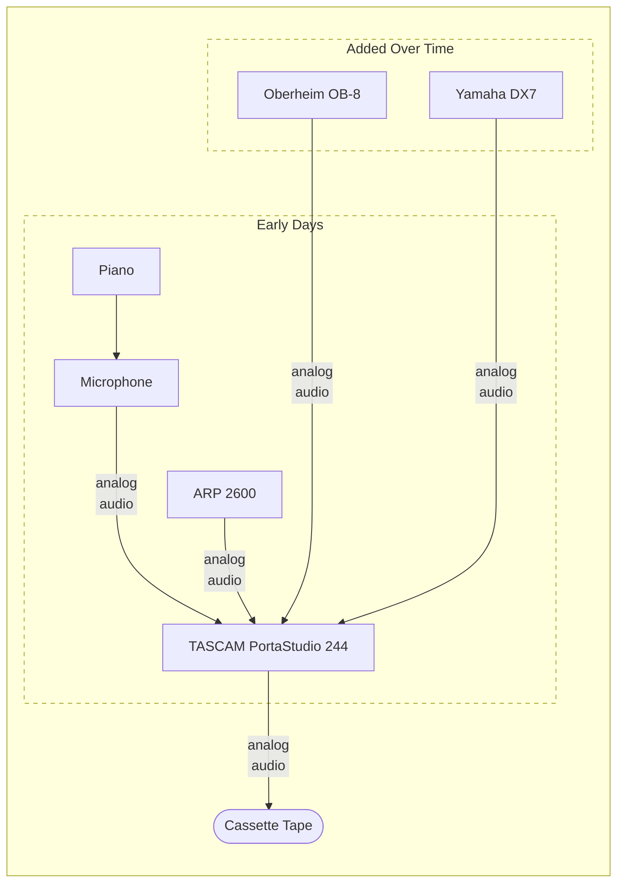
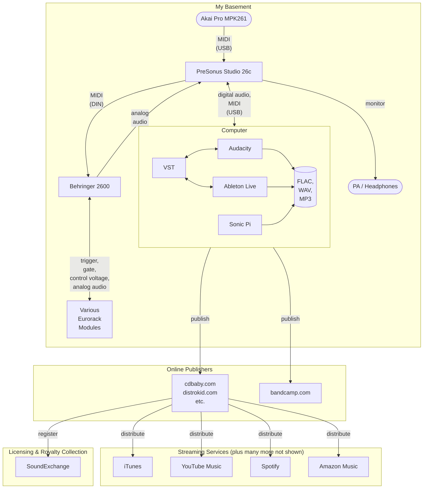

# Music

## Streaming

_Or search for "Kirk Rader" on the music service you prefer..._

### Amazon Music

<https://music.amazon.com/artists/B004L4HW52/kirk-rader>

    
Amazon Music QR

    

### Apple Music

<https://music.apple.com/us/artist/kirk-rader/417090159>

    
Apple Music QR

    

### Spotify

<https://open.spotify.com/artist/06lMz4EjJn3pYej2kGIL5t>

    
Spotify QR

    

### YouTube Music

<https://music.youtube.com/channel/UCp__q4DYBXYhq9uiD2Y8vUg>

    
YouTube Music QR

    

## Background

[I started creating electronic music](#yesterday) on the West Coast of the US,
in the "West Coast Style," long before I knew that there was such a thing. My
musical tastes have always been outside the mainstream. The first album I
purchased with my "own" money was a vinyl recording (there were no other
commercially significant recording media for sale in the mid 1960's) of
Schubert's _Unfinished Symphony_ which I had worn the grooves out of by the
time I turned 7 years old. When I was studying formal linguistics and teaching
myself to program computers in my late teens and early twenties, I did so to a
personal soundtrack that featured Lou Reed's _Metal Machine Music_ (yes, the
album consisting of 4 LP sides of electric guitar feedback and effects pedal
noise that literally ended his career just as it was beginning to take off in
the mid 70's and then went on to become the [stuff of
legends](https://www.zeitkratzer.de/metal-metal-machine-music-zeitkratzer-performing-lou-reeds-milestone-)
decades later).

My favorite composers include Tallis, Monteverdi, Vivaldi, Bach,
Handel, Beethoven, Glass and Byrne as well as hard-core mid-century
experimentalists like Stockhausen and Subotnick. If you have never
heard any of my own stuff, consider the combination of those
influences as fair warning.

Over the years I have used a variety of traditional
instruments and electronic gear to make, er, um, "music?"
Yes, let's call it "music."

## Approaches & Techniques

My process for creating music has evolved as new technologies have become
available, but conceptually is not all that different from how I [started
out](#yesterday) as a composer. I have loved listening to many types of music
all my life. The first album that I bought with my "own" money was a recording
of Schubert's _Unfinished Symphony_. I had worn the grooves out of it by the
time I turned seven years old. By the time I was in my late teens, I was
writing papers for my degree in Formal Linguistics and, a couple of years
later, teaching myself to program computers while listening to a personal
soundtrack that featured Lou Reed's _Metal Machine Music_ -- yes, the 4-LP
sides' worth of guitar feedback and effects noise that ended his career just as
it was starting to take off in the late 1970's. You will find strong hints of
all those influences - classical and experimental music together with
mathematics and a love of algorithms - throughout my musical _oeuvre_. To me,
an analog synthesizer is a device for translating what are essentially
mathematical formulas into acoustic impulses, which are occasionally and
serendipitously esthetically pleasing (at least to someone with my extremely
idiosyncratic tastes). Computer software makes that even more literally true.

### Mostly Analog

The majority of my pieces are created using a process not very different from
how I worked in the 70's. I usually begin with a concept for a modular synth
patch. These are usually pretty basic notions of ways to connect (and sometimes
cross-connect) modules in the signal and control paths, such as "use the
interference pattern of two low-frequency oscillators to create a rhythm," "use
pitch sweeps driven by an envelope generator on the inputs to a ring modulator
to create dynamic timbre" and the like. I then simply play around with such
patches -- changing the underlying wave forms, inverting the phase of some of
the low-frequency oscillator signals, changing the base frequency relationships
when using FM, and so on -- until I find something that appeals to my very
idiosyncratic tastes sufficiently to be worth recording. I then repeat the same
process to create multiple layers of sound for a given composition. Where I
used a multitrack analog recorder back in the day, I now use _Audacity_ to
record each sonic layer. Finally, I align and trim the tracks, add fades and
similar basic editing in the DAW to produce a final mix as a FLAC file.

Most of the time, when I "play" a piece during the recording process it is by
adjusting potentiometers to alter the patch in real time. Often I don't do even
that during the recording but, instead, allow the "logic" of a given patch to
play itself out over time. When I use a keyboard at all when working this way,
it is usually to provide trigger and gate voltages rather than to play "notes"
in the traditional sense. One characteristic of modular analog synthesis is
that small changes to a given patch can produce dramatic differences in the
resulting sound. Multiple tracks on a given album may be the result of the
process I just described, using relatively minor variations of a single patch.

An aspect of this approach is that there usually is neither a musical score in
the conventional sense nor any way to recover the exact combinations of
settings and initial phase relationships of the various modules contributing to
a patch. Once a track is recorded, that recording is the only representation of
that exact "composition" and there would be no way for me or anyone else to
perform it again and get the same result. This is one of the features of "West
Coast" analog electronic music that I find conceptually attractive. There is a
complete break not only from traditional tunings, structures and forms but the
totality of a musical composition created in this way is represented entirely
by its acoustic signature and nothing else.

### But More Than a Little Digital

[All of that said](#mostly-analog), I have increased my use over the years of
tools and techniques that simply did not exist when I was young. Some of the
sounds on my albums were produced using completely digital synthesis. These are
often in the form of digital audio samples or the output of VST plugins using
software like _Ableton Live_ and _Sonic Pi_. Using _Ableton Live_, I can play a
keyboard (to within the very narrow limis of my skill) to produce more
conventionally tonal music. Some pieces consist only of tracks recorded in this
way, while others combine analog and digital sound sources in various ways.

For example, the two versions of _Farandole Lamentoso_ on my album _The Modern
Temple of Amusement_ were created using a single _Sonic Pi_ program generating
output in two ways: the "8-bit mix" consists of a digital audio file generated
directly by _Sonic Pi_ using some of its built-in digital synthesizers. The
"2600 remix" uses the _Behringer 2600_ as the sound source, driven by the same
_Sonic Pi_ program, but by sending a sequence of MIDI commands rather than
generating digital audio directly. Because the _2600_ is monophonic, the latter
version required running the program multiple times with slight modifications
each time to produce the MIDI sequence for each voice separately.

Another piece, _Ghostly Reminiscences_, on the same album as the _Farandole_,
was produced entirely as the output of another _Sonic Pi_ program. Even when
using digital tools like _Sonic Pi_, I tend to use randomization and sonic
layering to produce unconventional timbres, rhythms and harmonies that will
vary endlessly no matter how long they are looped. These Ruby source code files
are the closest I am likely to come to writing "scores" for any of my music.
This is my "West Coast" approach applied to using "East Coast" inspired gear
and software.

See [SonicPi "Scores"](#sonicpi-scores) for [Ruby](https://www.ruby-lang.org) code
examples as musical scores.

## Studio Setups

### Yesterday

Here is the setup I used when creating tracks in the 70's and 80's, a few of
which eventually were published as the album _Undecidable_ in 2011, once
self-publishing music started to become a thing:

- [Wm Knabe & Co Piano](https://www.knabepianos.com)
- [ARP 2600](https://en.wikipedia.org/wiki/ARP_2600)
- [Oberheim OB-8](https://en.wikipedia.org/wiki/Oberheim_OB-8)
- [Yamaha DX7](https://en.wikipedia.org/wiki/Yamaha_DX7)
- [TASCAM PortaStudio 244](https://en.wikipedia.org/wiki/Portastudio)

The _Knabe_ piano I had as a kid was built in the 1930's and sounded far better
recordings were made in my childhood bedroom or various apartments I had as a
college student and young adult using decidedly consumer-level microphones and
recording technologies of the era. The jankiness of the audio quality appeals
to me as an artifact of the period of my life and the circumstances in which
they were created, but I cannot argue with anyone who finds it less charming
than I.

### Today

The albums I have been publishing more recently have been created using
variations of this setup:

#### Hardware

- [Akai Pro MPK261](https://www.akaipro.com/mpk261) keyboard
- [Behringer 2600](https://www.behringer.com/product.html?modelCode=P0DNJ)
  modern clone of the _ARP 2600_ I used as a kid
- [PreSonus Studio 26c](https://www.presonus.com/products/studio-26c)
  ADC

...plus various Eurorack modules that change embarassingly frequently

#### Software

- [Audacity](https://www.audacityteam.org/) Digital Audio Workstation (DAW)
- [Ableton Live](https://www.ableton.com/) real-time digital synthesis and effects
- [Sonic Pi](https://sonic-pi.net/) Ruby dialect and runtime platform for
  creating digital music and controlling MIDI instruments

...running on an infuratingly overpriced, poorly designed and implemented iMac
due to lack of support for anything else by the manufacturers of audio related
hardware and software
