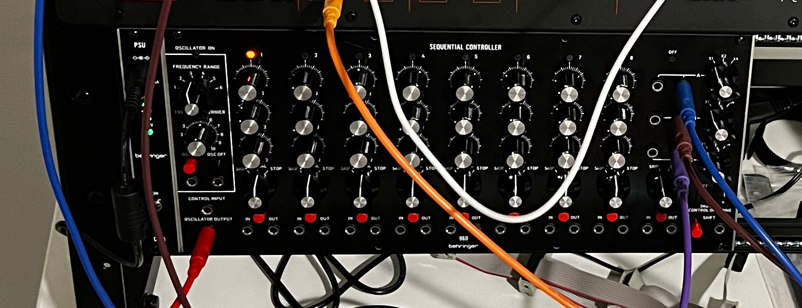
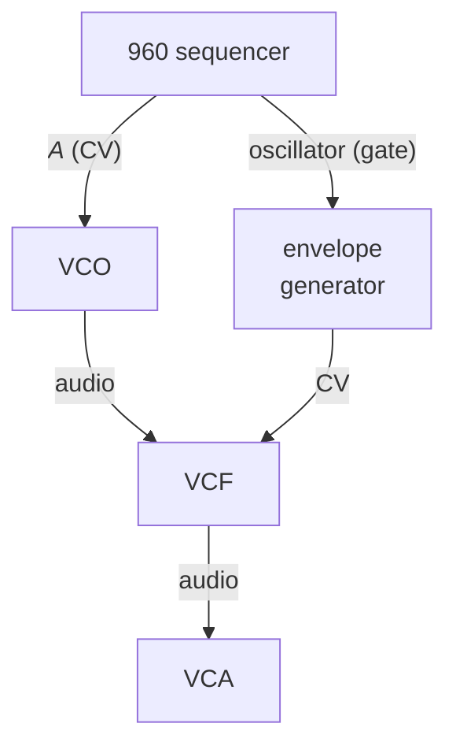
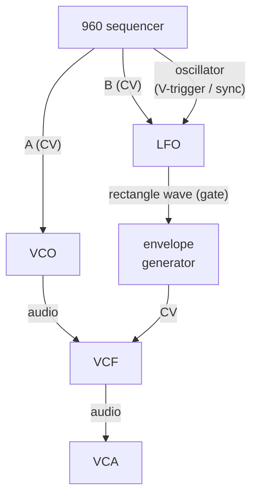
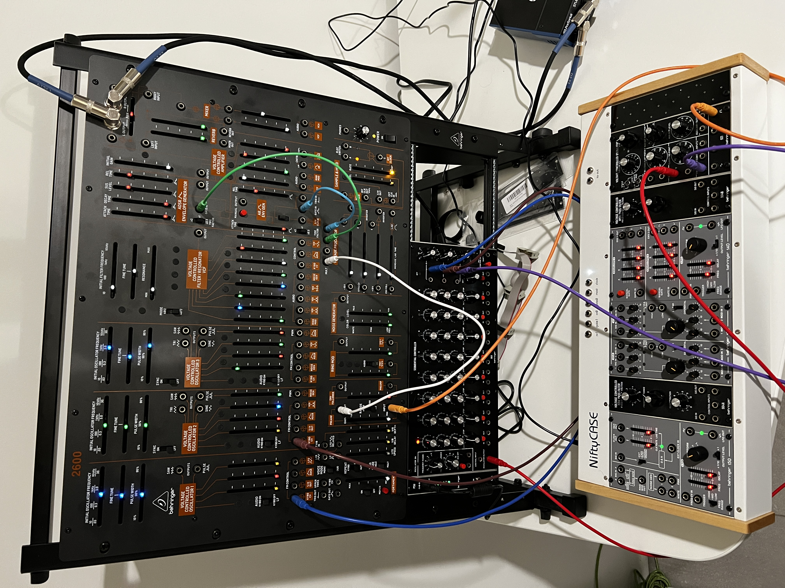
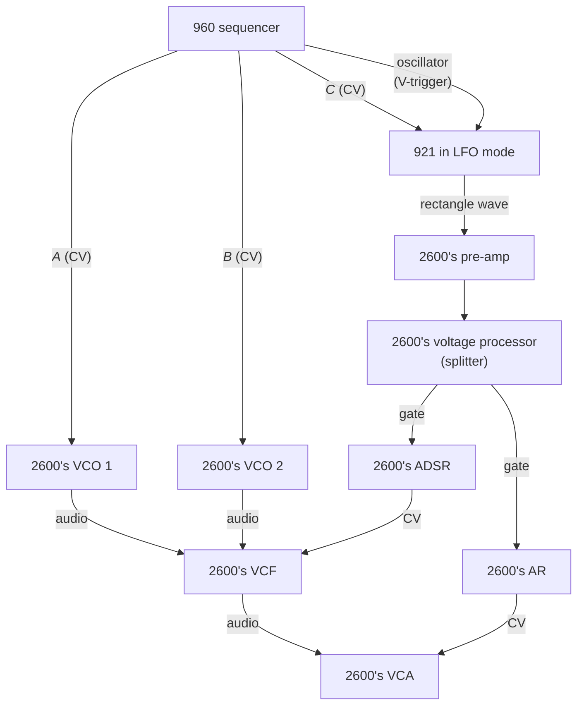

_Copyright &copy; 2024 Kirk Rader_

# Ratcheting

A favorite trick of 70's and 80's electronic music in the style pioneered and
epitomized by the likes of Klaus Schulze, Tangerine Dream, et al. involved a
technque known as _ratcheting_. It depends on features of analog sequencers
modeled on the one built into the venerable Moog _System 55_. That sequencer
lives on in the form of the _Behringer 960_ eurorack module:

The 960's primary outputs are three control voltages, labeled _A_, _B_, and _C_,
together with a low frequency rectangle wave representing its internal clock.
The low frequency rectangle wave can be used as a gate trigger for other modules
while the _A_, _B_, and _C_ CV values can be used to control the frequency of
VCO's, the amplitude of VCA's, etc. The three rows of potentiometer knobs taking
up the majority of the 960's front panel are used to control the A, B, and C
output CV values. The frequency range knob and frequency vernier potentiometer
control the frequency of the LFO. When running, the 960 will cycle through up to
eight CV values per _A_, _B_, and _C_ row at the rate determined by the
frequency of the internal LFO. The CV value at each step in the cycle is
determined by the setting of the potentiometer in the corresponding column.

Consider a simple patch in which the CV output labeled _A_ is controlling the
frequency of a VCO and the LFO output is being used as the gate trigger of an
envelope generator:

The result might sound like:

<audio controls>
    <source src="./example01.mp3" />
</audio>

The tempo of the preceding "melody" is determined by the 960's LFO. The pitch of
each note is determined by the value of the CV output from the _A_ row being
added to the base frequency of the VCO it is controlling.

Endless variations are possible thanks to the magic of modular synthesizers. You
could add up to two more VCO's, controlled by the _B_ and _C_ outputs, so that
the sequence consisted of a chord at each step rather than a solo note. Or one
of the CV outputs could control the VCA, to vary the amplitude from note to note
in the sequence along with the pitch.

Other things being equal, the 960's internal LFO emits a rectangle wave at a
constant frequency, resulting in a metronome-like "rhythm." The 960 supports a
mode (via a switch on the front panel) in which the _C_ row's potentiometers
control the frequency of the internal LFO on a step-by-step basis. This supports
sequences where some notes are held longer than others to achieve musically
interesting rhythms.

Even more complex rhythms can be achieved by extending all of the above using a
technique known as _ratcheting_. Ratcheting adds another LFO to the patch, where
the second LFO provides the gate triggers and one of the 960's CV outputs
controls the fequency of the second LFO:

Note that the preceding requires a bit of fiddling with the relative frequencies
and pulse widths of the 960's built-in "clock" oscillator and the second LFO
that is used to generate the gate trigger for the envelope generator. It also
requires the use a LFO module that provides a "trigger" or "sync" input for
synchronizing the rectangle waves' phases.

When done correctly, the CV feeding the LFO (_B_ in the preceding diagram)
allows the potentiometers in that row to trigger different numbers of beats per
step, at a much finer grained level than the built-in time adjustment supported
by the C row. This is because the sequencer's CV output changes the frequency of
the external LFO at each step and it is the external LFO that actually triggers
the envelope generator.

Here is an actual patch that uses a _Behringer 2600_ as the sound source, with
the sequencing provided by a _Behrigner 960_ sequencer and ratcheting via a
_Behinger 921_ LFO (another module reproducing a component from the _System
55_):

which looks schematically like:

> Notes:
>
> * None of the other modules in the 2600 nor the external eurorack case depicted
>  in the preceding image are involved in this patch
>
> * The signal from the 921 LFO must be amplified a bit in order to function as a
>  gate trigger for the 2600's envelope generators (this could be mitigated by a
>  CV-to-trigger converter like the _Behringer 961_ module)
>
> * The melody of the chord progression is determined by the 960's _A_ and _B_
>   rows
>
> * The overall tempo of the chord progression is determined by the frequency of
>   the 960's internal LFO
>
> * The number of times the chord plays at each step in the sequence is
>   determined by the combination of the base frequency of the 921 oscillator
>   and the value of the corresponding potentiometer in the 960's _C_ row

This is what the preceding sounds like, where the base frequency of the 921 is
increased and decreased at various points while the sequencer is running:

<audio controls>
    <source src="./ratcheting_up_and_down.mp3" />
</audio>

Even though the overall tempo of the chord progression remains constant, as
determined by the 960's onboard "clock," each step is subdivided into differing
numbers of repeated notes based on the setting of row _C_'s potentiometers,
scaled by the base frequency of the "outboard" LFO actually triggering the
envelope generator.

As noted above, all of this requires some fine-tuning of the internal and
external LFO's and the various _C_ potentiometers to achieve musical sounding
results. It also requires an external LFO that can be synchronized to the 960's
clock using a gate (i.e. V-trigger) input. (The latter is why I used a 921 as
the second LFO rather than any of the 2600's VCO's. The 2600's VCO's can be
synced among themselves, but not to external waveforms.)
