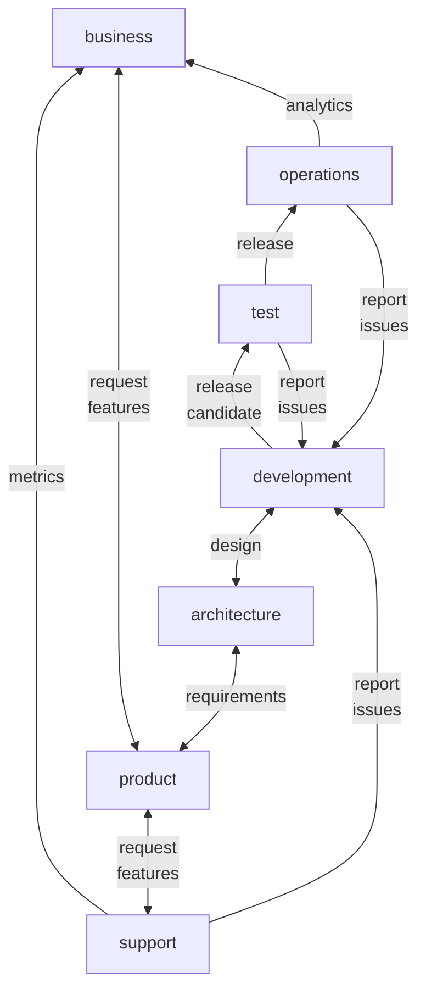

Let \\( \Omega = \omega(\omega) \\) where \\( \omega = \lambda x.x(x) \\)

- [Music](music.md)

```mermaid
graph BT

    product <-- "request\nfeatures" --> business
    support -- "metrics" --> business
    support <-- "request\nfeatures" --> product
    product <-- "requirements" --> architecture
    architecture <-- "design" --> development
    development -- "release\ncandidate" --> test
    test -- "report\nissues" --> development
    support -- "report\nissues" --> development
    test -- "release" --> operations
    operations -- "report\nissues" --> development
    operations -- "analytics" --> business

    %%business -- "analyze" --> business
    %%product -- "iterate" --> product
    %%architecture -- "iterate" --> architecture
    %%development -- "iterate" --> development
    %%test -- "test" --> test
    %%operations -- "configure,\nmonitor" --> operations
```
