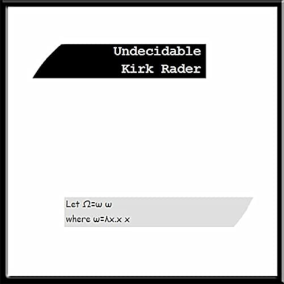
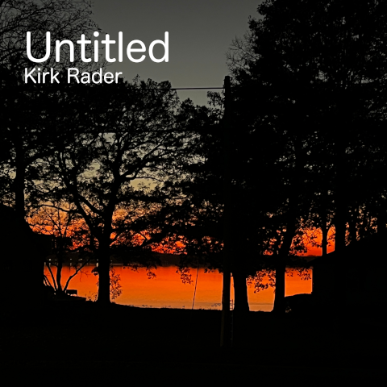
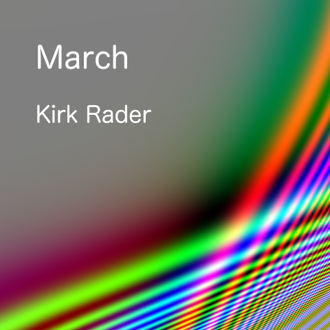
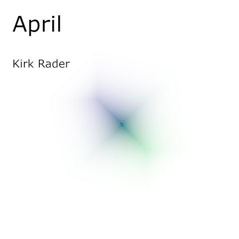
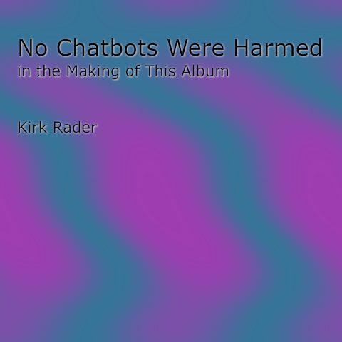
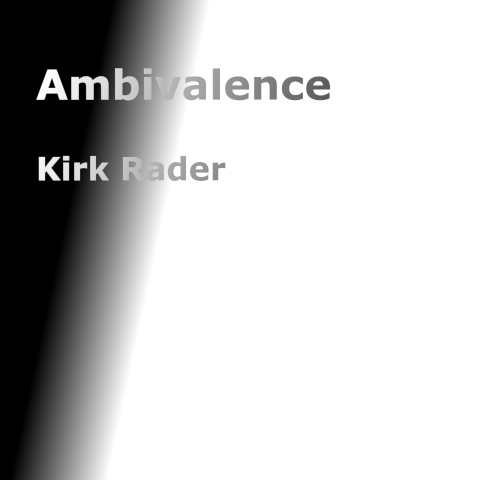
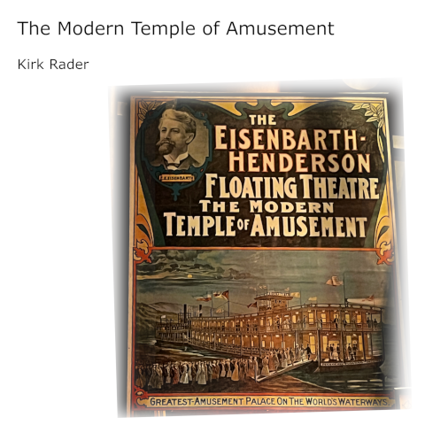
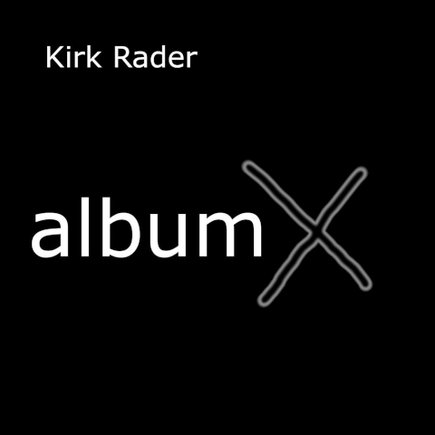
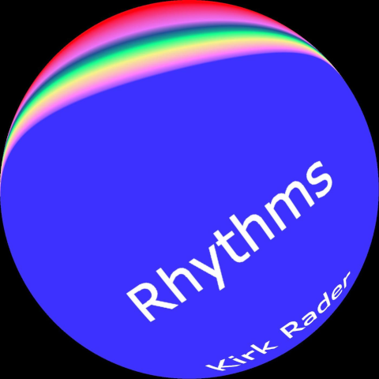

&copy; Copyright Kirk Rader 2023. All rights reserved.

# Musicography

> - [Amazon Music](amazon.md)
> - [Apple Music](apple.md)
> - [Bandcamp](bandcamp.md)
> - [Spotify](spotify.md)
> - [Youtube Music](youtube.md)
>
> _Or search for "Kirk Rader" on the music service you prefer_

---

I started creating electronic music on the West Coast, in the "West Coast
Style," long before I knew that there was such a thing. My musical tastes
have always been outside the mainstream. The first album I purchased with my
"own" money was a vinyl recording (there were no other commercially significant
recording media for sale in the mid 1960's) of Schubert's _Unfinished Symphony_
which I had worn the grooves out of by the time I turned 7 years old. When I was
studying formal linguistics and teaching myself to program computers in my late
teens and early twenties, I did so to a personal soundtrack that featured Lou
Reed's _Metal Machine Music_ (yes, the album consisting of 4 LP sides-worth of
electric guitar feedback and effects pedal noise that literally ended his career
just as it was beginning to take off in the mid 70's and then went on to become
the stuff of legend decades later).

My favorite composers include Tallis, Monteverdi, Vivaldi, Bach, Handel,
Beethoven, Glass and Byrne as well as hard-core mid-century experimentalists
like Stockhausen and Subotnick. If you have never heard any of my own stuff,
consider the combination of those influences as fair warning.

---

## Undecidable[*](#undecidable_note)

**UPC:** 885767506688

**Released:** 2011 (recorded 1978 - 1985)

| Track No | Track             | ISRC            |
| -------- | ----------------- | --------------- |
| 1        | Opus 1            | QM-YYH-11-00001 |
| 2        | Opus 2            | QM-YYH-11-00002 |
| 3        | Sample and Hold 2 | QM-YYH-11-00003 |
| 4        | Segnahc Cigam     | QM-YYH-11-00004 |
| 5        | Sample and Hold 1 | QM-YYH-11-00005 |
| 6        | Opus 6            | QM-YYH-11-00006 |

---

## Dum Vivimus

**UPC:** 198015910503

**Released:** 2023

| Track No | Track                                | ISRC            |
| -------- | ------------------------------------ | --------------- |
| 1        | 2600 Redux                           | QZ-XKT-23-00001 |
| 2        | Dum Vivimus                          | QZ-XKT-23-00002 |
| 3        | Vivamus                              | QZ-XKT-23-00003 |
| 4        | Sliders and Knobs                    | QZ-XKT-23-00004 |
| 5        | and Cables                           | QZ-XKT-23-00005 |
| 6        | One Modulator to Rule Them All       | QZ-XKT-23-00006 |
| 7        | Sonatina in No Particular Key Part 1 | QZ-XKT-23-00007 |
| 8        | Noise to Signal                      | QZ-XKT-23-00008 |

---

## Untitled

**UPC:** 198015912095

**Released:** 2023

| Track No | Track                      | ISRC            |
| -------- | -------------------------- | --------------- |
| 1        | Untitled                   | QZ-XKT-23-00009 |
| 2        | Whoop Whoop                | QZ-XKT-23-00010 |
| 3        | Ring of Sines and a Square | QZ-XKT-23-00011 |

---

## Songs Not Yet and No Longer Sung

**UPC:** 198015955498

**Released:** 2023

| Track No | Track                                | ISRC            |
| -------- | ------------------------------------ | --------------- |
| 1        | Sonatina in No Particular Key Part 2 | QZ-XKT-23-00012 |
| 2        | Fire and Forget                      | QZ-XKT-23-00013 |
| 3        | Divergence                           | QZ-XKT-23-00014 |
| 4        | Douse and Remember                   | QZ-XKT-23-00015 |
| 5        | Faerie                               | QZ-XKT-23-00016 |
| 6        | Múspellsheimr                        | QZ-XKT-23-00017 |
| 7        | Niflheimr                            | QZ-XKT-23-00018 |
| 8        | Lament                               | QZ-XKT-23-00019 |
| 9        | Ostinato                             | QZ-XKT-23-00020 |

---

## March

**UPC:** 198025013270

**Released:** 2023

| Track No | Track               | ISRC            |
| -------- | ------------------- | --------------- |
| 1        | March               | QZ-XKT-23-00021 |
| 2        | Ludwig van Synthpop | QZ-XKT-23-00022 |
| 3        | E Minor Tune        | QZ-XKT-23-00023 |

---

## April

**UPC:** 198025078903

**Released:** 2023

| Track No | Track                                | ISRC            |
| -------- | ------------------------------------ | --------------- |
| 1        | Sonatina in No Particular Key Part 3 | QZ-XKT-23-00025 |
| 2        | Krell National Anthem                | QZ-XKT-23-00024 |
| 3        | Triad                                | QZ-XKT-23-00026 |
| 4        | Iaulath Berúthiel                    | QZ-XKT-23-00027 |
| 5        | Sinusoidal Syncopation               | QZ-XKT-23-00029 |
| 6        | PWM                                  | QZ-XKT-23-00030 |
| 7        | Fall,  Rise                          | QZ-XKT-23-00028 |

---

## No Chatbots Were Harmed in the Making of This Album

**UPC:** 198025252013

**Released:** 2023

| Track No | Track                                 | ISRC            |
| -------- | ------------------------------------- | --------------- |
| 1        | Analogy in C Minor                    | QZ-XKT-23-00036 |
| 2        | &pi;                                  | QZ-XKT-23-00031 |
| 3        | Regret                                | QZ-XKT-23-00032 |
| 4        | YNBBB                                 | QZ-XKT-23-00033 |
| 5        | Chicxulub                             | QZ-XKT-23-00035 |
| 6        | Rainy Day Fanfare                     | QZ-XKT-23-00037 |
| 7        | At His Heels,  Leashed In Like Hounds | QZ-XKT-23-00038 |
| 8        | Crouched for Employment               | QZ-XKT-23-00039 |
| 9        | Analogy in C Major                    | QZ-XKT-23-00034 |

---

## Ambivalence

**UPC:** 198025421488

**Released:** 2023

| Track No | Track         | ISRC            |
| -------- | ------------- | --------------- |
| 1        | Effulgence    | QZ-XKT-23-00045 |
| 2        | Vigilance     | QZ-XKT-23-00040 |
| 3        | Perseverance  | QZ-XKT-23-00041 |
| 4        | Coherence     | QZ-XKT-23-00042 |
| 5        | Reluctance    | QZ-XKT-23-00043 |
| 6        | Ebullience    | QZ-XKT-23-00044 |
| 7        | Somnambulance | QZ-XKT-23-00046 |
| 8        | Emergence     | QZ-XKT-23-00047 |
| 9        | Disturbance   | QZ-XKT-23-00049 |
| 10       | Transcendence | QZ-XKT-23-00048 |

---

## The Modern Temple of Amusement

**UPC:** 198025591679

**Released:** 2023

### Volume 1

| Track No | Track                            | ISRC            |
| -------- | -------------------------------- | --------------- |
| 1        | Floating Theater                 | QZ-XKT-23-00050 |
| 2        | Mount Vesuvius                   | QZ-XKT-23-00051 |
| 3        | Soliloquy                        | QZ-XKT-23-00052 |
| 4        | Dramma Bernesco                  | QZ-XKT-23-00053 |
| 5        | Ghostly Reminiscences            | QZ-XKT-23-00054 |
| 6        | Au Quai                          | QZ-XKT-23-00055 |
| 7        | Farandole Lamentoso (8-bit mix)  | QZ-XKT-23-00056 |
| 8        | Farandole Lamentoso (2600 remix) | QZ-XKT-23-00057 |
| 9        | Steamboatman                     | QZ-XKT-23-00058 |
| 10       | Foggy River                      | QZ-XKT-23-00059 |
| 11       | Decommissioned                   | QZ-XKT-23-00060 |

### Volume 2

| Track No | Track            | ISRC            |
| -------- | ---------------- | --------------- |
| 1        | Repercussions 1  | QZ-XKT-23-00061 |
| 2        | Repercussions 2  | QZ-XKT-23-00062 |
| 3        | Repercussions 3  | QZ-XKT-23-00063 |
| 4        | Repercussions 4  | QZ-XKT-23-00064 |
| 5        | Repercussions 5  | QZ-XKT-23-00065 |
| 6        | Repercussions 6  | QZ-XKT-23-00066 |
| 7        | Repercussions 7  | QZ-XKT-23-00067 |
| 8        | Repercussions 8  | QZ-XKT-23-00068 |
| 9        | Repercussions 9  | QZ-XKT-23-00069 |
| 10       | Repercussions 10 | QZ-XKT-23-00070 |

---

## Album 10

**UPC:** 198025739965

**Released:** 2023

| Track No | Track                | ISRC            |
| -------- | -------------------- | --------------- |
| 1        | Incipio ex regulum   | QZ-XKT-23-00071 |
| 2        | Introduction         | QZ-XKT-23-00072 |
| 3        | Variation 1          | QZ-XKT-23-00073 |
| 4        | Interlude 1          | QZ-XKT-23-00074 |
| 5        | Variation 2          | QZ-XKT-23-00075 |
| 6        | Interlude 2          | QZ-XKT-23-00076 |
| 7        | Variation 3          | QZ-XKT-23-00077 |
| 8        | Interlude 3          | QZ-XKT-23-00078 |
| 9        | Recapitulation       | QZ-XKT-23-00079 |
| 10       | Reductio ad absurdum | QZ-XKT-23-00080 |
| 11       | Epilogue             | QZ-XKT-23-00081 |

## Rhythms

**UPC:** 198025759802

**Released:** 2023

| Track No | Track                                                | ISRC            |
| -------- | ---------------------------------------------------- | --------------- |
| 1        | Rhythm 1                                             | QZ-XKT-23-00082 |
| 2        | Rhythm 2                                             | QZ-XKT-23-00083 |
| 3        | Rhythm 3                                             | QZ-XKT-23-00083 |
| 4        | Rhythm 4                                             | QZ-XKT-23-00085 |
| 5        | Rhythm 5                                             | QZ-XKT-23-00086 |
| 6        | Rhythm 6                                             | QZ-XKT-23-00087 |
| 7        | Euclidean Tablas and Random Drones                   | QZ-XKT-23-00088 |
| 8        | Sinfonietta for Cowbell Orchestra                    | QZ-XKT-23-00089 |
| 9        | Concerto for Cowbell, Low Percussion and Manic Choir | QZ-XKT-23-00090 |
| 10       | Farandole in Tempore Belli                           | QZ-XKT-23-00091 |

- [Sonic Pi source for _Fanrandole in Tempore Belli_](../sonicpi/Farandole_in_Tempore_Belli.md)

---

<a id="undecidable_note">*</a> Even though you didn't ask and probably weren't
wondering, the title _Undecidable_ and its cover art featuring a formula of the
[lambda calculus](https://en.wikipedia.org/wiki/Lambda_calculus) is an inside
joke with myself in reference to my studying formal linguistics and symbolic
logic at UCLA &mdash; including taking classes from
[Alonzo Church](https://en.wikipedia.org/wiki/Alonzo_Church), himself &mdash;
during the period when many of those tracks were recorded.

Given:

\\(
\begin{align*}
    \text{Let } \Omega & = \omega \hskip0.25em \omega \\\\
    \text{where } \omega & = \lambda x.x \hskip0.25em x
\end{align*}
\\)

The value of \\(\Omega\\) is "undecidable" according to the rules of the lambda
calculus because the calculation of \\(\lambda x.x \hskip0.25em x\\) never
terminates when applied to itself. I experimented a lot with feedback from the
signal path back into the control path (the sort of thing you can really only
do with modular analog synthesizers) so I adopted this self-referential
mathematical formula as a logo. This resonated (pun intended) with me because
undecidability due to self-reference is the key not only to the ancient
[liar's paradox](https://en.wikipedia.org/wiki/Liar_paradox), it is also the
basis of Goedel's
[incompleteness proof](https://en.wikipedia.org/wiki/G%C3%B6del%27s_incompleteness_theorems)
in formal linguistics, the explanation of why there is no general solution to
the [halting problem](https://en.wikipedia.org/wiki/Halting_problem) in computer
science and underlies many other similarly consequential results in math and
science, while feedback (a physical manifestation of "self reference") is a way
to produce complex (and often catastrophic) results from simple mechanical or
electronic systems.

As an even less relevant aside, I chose \\(\Omega\\) (the last letter of the
Greek alphabet) as the name of the undecidable result because that is the
variable name traditionally used when referring to the cardinality of the set of
natural numbers and that, according to accepted wisdom, is the smallest infinite
magnitude. It also happens to be the "stack depth" of an infinitely recursive
function. Why is that amusing? Well, I was also teaching myself computer
programming later in the same period that I was creating those tracks, so...
maybe it isn't all that amusing. But it makes me smile to think that the most
abstruse branches of "pure" mathematics like
[computability theory](https://en.wikipedia.org/wiki/Computability_theory) can
inadvertently produce literally world-changing effects such as the
post-industrial "Information Age."
