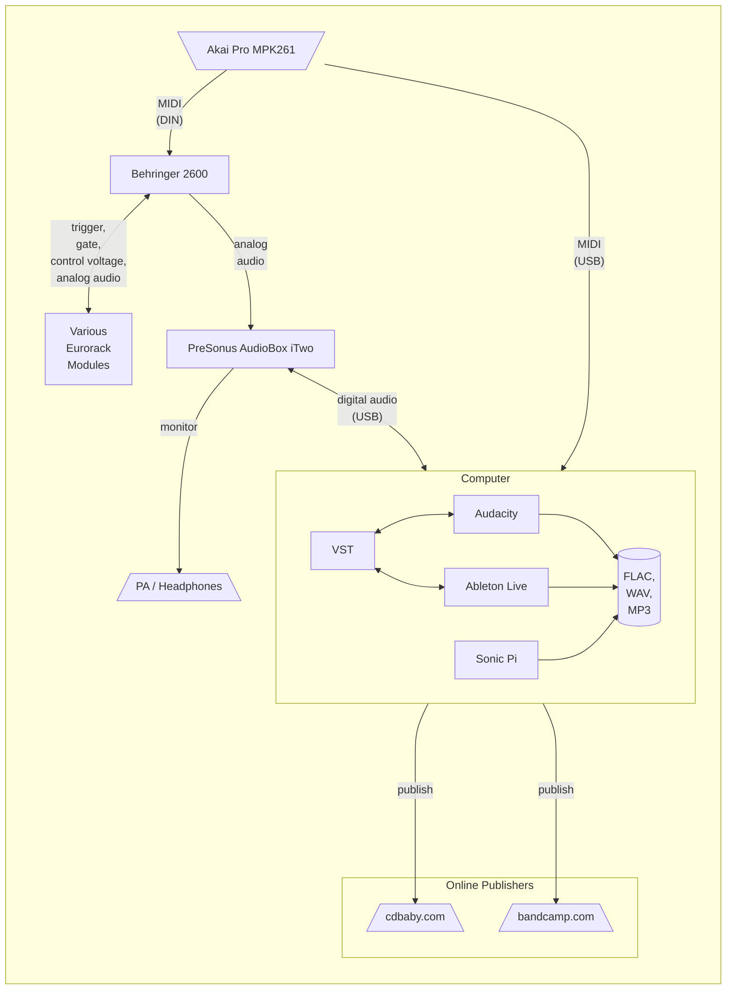

# Today

<!-- toc -->

The albums I have been publishing more recently have been created using variations of this setup:

## Hardware

- [Akai Pro MPK261](https://www.akaipro.com/mpk261) keyboard
- [Behringer 2600](https://www.behringer.com/product.html?modelCode=P0DNJ) clone of the _ARP 2600_ I used as a kid
- [PreSonus AudioBox iTwo](https://www.presonus.com/en-US/interfaces/usb-audio-interfaces/audiobox-series/2777700108.html) ADC

...plus various Eurorack modules that change embarassingly frequently

## Software

- [Audacity](https://www.audacityteam.org/) DAW
- [Ableton Live](https://www.ableton.com/) real-time digital synthesis and effects
- [Sonic Pi](https://sonic-pi.net/) Ruby dialect and runtime platform for creating music

...running on a creaky old MacBook Pro laptop