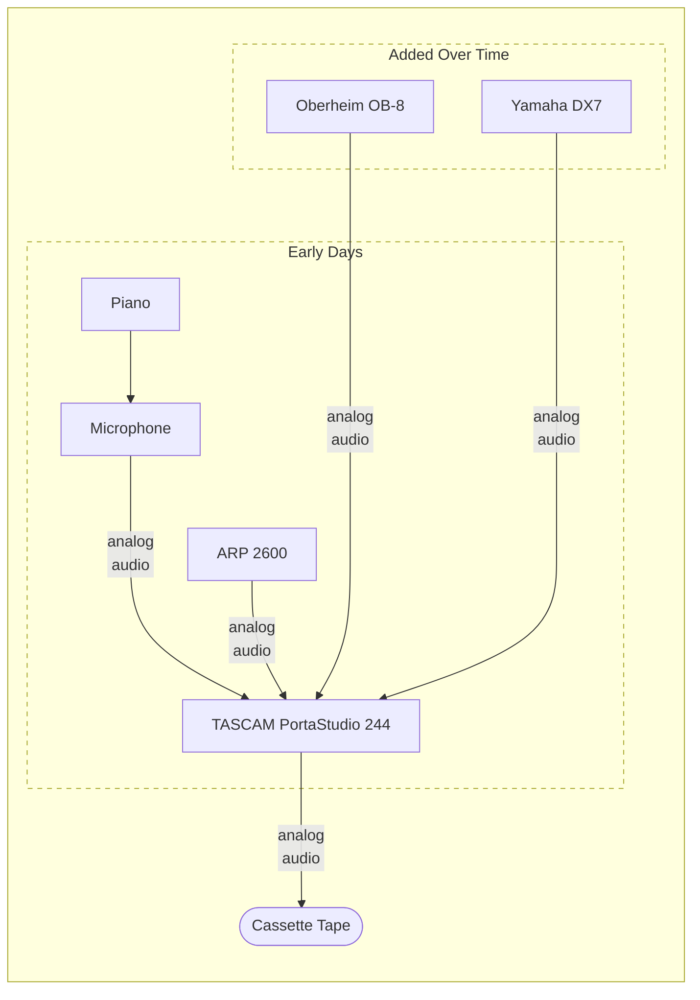

# Yesterday

Here is the setup I used when creating tracks in the 70's and 80's, a few of
which eventually were published as the album _Undecidable_ in 2011, once
self-publishing music started to become a thing:

- [Wm Knabe & Co Piano](https://www.knabepianos.com)
- [ARP 2600](https://en.wikipedia.org/wiki/ARP_2600)
- [Oberheim OB-8](https://en.wikipedia.org/wiki/Oberheim_OB-8)
- [Yamaha DX7](https://en.wikipedia.org/wiki/Yamaha_DX7)
- [TASCAM PortaStudio 244](https://en.wikipedia.org/wiki/Portastudio)

The _Knabe_ piano I had as a kid was built in the 1930's and sounded far better
in real life than on the surviving cassette recordings. Most of these recordings
were made in my childhood bedroom or various apartments I had as a college
student and young adult using decidedly consumer-level microphones and recording
technologies of the era. The jankiness of the audio quality appeals to me as an
artifact of the period of my life and the circumstances in which they were
created, but I cannot argue with anyone who finds it less charming than I.
