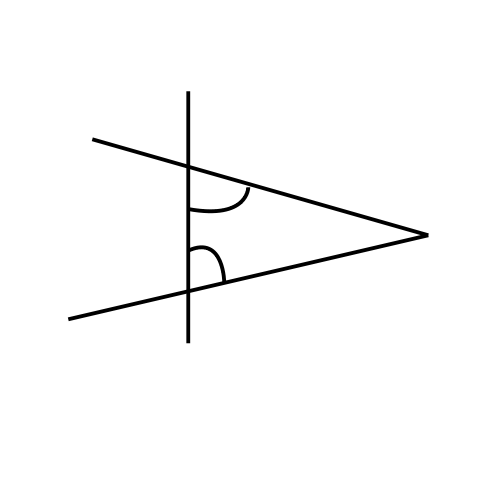
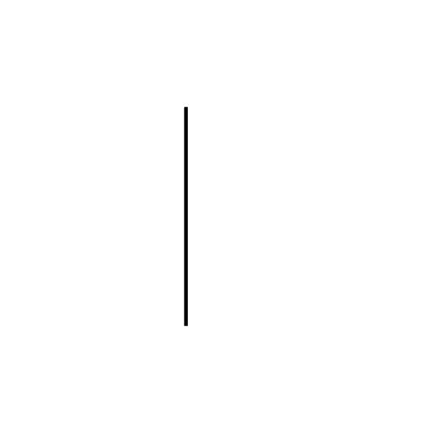

&copy; Copyright Kirk Rader 2023. All rights reserved.

# How the Parallel Postulate Changed Everything

<!-- toc -->

## Abstract

Mathematicians from Euclid's time to the start of the modern era were strangely
obsessed with the fifth, a.k.a. parallel postulate from his treatise on
two-dimensional Geometry, [Elements](https://en.wikipedia.org/wiki/Euclid%27s_Elements).
Over the course of millenia there were countless attempts to prove whether the
parallel postulate was really an axiom or, as was suspected for a long time but
eventually disproven, actually a theorem hiding simpler axioms under its
petticoats. The solution to this question precipitated a revolution in
mathematical theory and practice that ultimately birthed the post-modern
"information age" as well as contributing to scientific and engineering advances
across many disciplines, including General Relativity and Quantum Mechanics.

No, really.

## Euclid's Parallel Postulate

Once upon a time, mathematicians in the Western tradition regarded themselves as
engaged in a science, not different in kind from chemistry or physics. In this
way of regarding mathematical truth, the fact that \\( 2 + 2 = 4 \\) is proven
by empirical observation: if I hold two pebbles in my hand then pick up two
more, I will be holding a total of four pebbles. This empiricism was used not
only to justify claims about which mathematical statements were true and which
were not, it guided the way that mathematical problems were posed and solved. As
mathematical theories advanced and techniques expanded to include an ever
increasing degree of abstraction, they remained for a very long time rooted in
empiricism. Negative numbers, for example, were initially justified by using the
kind of reasoning modern bookkeepers would recognize as a double-entry ledger.
(e.g. \\(-3 + 2 = -1\\) is like telling someone who is holding $2 that they owe
you $3; after they pay you all they have, they still owe you $1 &mdash; and that
is how ancient generations of mathematicians actually justified introducing
negative numbers into their calculations).

Euclid's _Elements_ epitomizes this view of the nature and practice of
mathematics. While providing the model for an axiomitic approach to mathematical
proof, his actual method was firmly based in _constructions_, which are
empirically verifiable operations using a physical straight-edge and compass.
Euclid's axioms and postulates all hearken directly to such empiricism. They are
nearly all very simple declarative statements of easily observable facts or
simple steps in a construction. "To extend a point to form a line," "to extend a
line to form a plane," and so on.

Then there is the fifth postulate, often referred to as the parallel postulate.
It looks nothing like the others. In Euclid's original formulation, it is a
nearly paragraph-sized sentence rather than a short phrase and can be difficult
to puzzle out without aid of a diagram. Even later attempts to produce simpler
formulations did not detract from the degree to which it seems like an outlier
compared to the other axioms and postulates.

> Euclid's parallel postulate:
>
> If a line segment intersects two straight lines forming two
> interior angles on the same side that are less than two right
> angles, then the two lines, if extended indefinitely, meet on
> that side on which the angles sum to less than two right angles.

From Euclid's time right into the start of the modern era, mathematicians were
not happy about this. Over the course of millenia, countless attempts were made
to show that the parallel postulate must actually be a theorem, derivable from
simpler axioms that look more like the others in Euclid's book. While this
produced a number of alternative formulations of the axiom, some of which may be
easier to visualize than others, none were a reduction to radically simpler
axioms. For example:

> Alternative formulation of the parallel postulate:
>
> Given a line and a point not on that line, there is exactly
> one line that can be drawn through the given point that
> does not meet the given line when both lines are
> extended indefinitely in both directions.

After enough time and failed attempts, Western mathematicians eventually shifted
their focus away from trying to prove that the parallel postulate was really a
theorem. Instead they strove to produce a formal definition of why it is
actually an axiom. By the early 19th Century, mathematical techniques had
evolved to the point that allowed the following kind of indirect proof to be
carried out:

1. Assume some different axiom that contradicts Euclid's parallel postulate in
   some specific way.

2. Show that the equivalent of Euclid's constructions and proofs that can be
   carried out using this different version of the parallel postulate are just
   as _internally consistent_ (i.e. produce no self-contradictions) as Euclid's
   "classical" proofs.

If the second step of the preceding argument can be accomplished for one or more
variations from the parallel postulate assumed in the first step, then this
proves that Euclid's fifth postulate was an axiom all along. If it were not an
axiom but a theorem, altering it would emerge as a contradiction among the more
basic axioms from which it would have been derived.

The key here is to separate the idea of "internal consistency" from "empirical
truth." The Non-Euclidean Geometries invented by
[Bolyai](https://en.wikipedia.org/wiki/J%C3%A1nos_Bolyai),
[Lobachevsky](https://en.wikipedia.org/wiki/Nikolai_Lobachevsky),
[Riemann](https://en.wikipedia.org/wiki/Bernhard_Riemann) _et al._ each produce
different theorems that contradict those described by Euclid, but as long as the
axioms for each such Non-Euclidean Geometry do not contradict themselves for a
given version of the parallel postulate, they demonstrate that each such
variation on the theme of "Geometry" is just as good, in some sense, as every
other &mdash; including Euclid's own. Carrying out proofs in Riemann's [Elliptic
Geometry](https://en.wikipedia.org/wiki/Elliptic_geometry) is like doing
Euclid-style constructions on the surface of a spheroid where all lines forming
"great circles" around the circumference will eventually intersect.
Lobachevsky's [Hyperbolic Geometry](https://en.wikipedia.org/wiki/Hyperbolic_geometry)
assumes, on the other hand, that you can draw more than one line through any
point none of which intersect some other line. This is harder to visualize than
Elliptic Geometry. In this case it is like doing Euclid-style constructions on a
surface with a hyperbolic curvature. Neither variation corresponds to what
happens when, like Euclid, you use a straight-edge and compass on a flat
surface. But neither Lobachevskian nor Riemannian Geometries produce
_self_-contradictory results. And so Euclid's fifth postulate was formally
demonstrated to have been an axiom all along.

Mathematicians of their day rejoiced at Bolyai's, Lobachevsky's and Riemann's
accomplishments for multiple reasons. They could finally regard the whole
question pertaining to the status of the parallel postulate as satisfactorily
settled. They could start playing with the new mathematical techiques developed
for this enterprise, seeking additional areas of mathematical exploration. But
there was a reckoning to be made as well: in order to accept this highly
desirable result, mathematicians were forced to alter fundamentally their
understanding of their own profession. Mathematics came to be understood as
being concerned with _validity_ (internal consistency) rather than (empirical)
_truth_. Euclid's theorems do not merely form an interesting set of mutually
consistent mathematical formulas. Euclid's reliance on "constructions"
demonstrate that his theorems describe properties of objects and operations
carried out in the real world. Non-Euclidean Geometries have no such
correspondence to observable reality (at least not at the scale at which human
senses operate). Not only does every valid Non-Euclidean Geometry contradict
Euclid's "common sense" Geometry, each contradicts every other. But if validity
is the goal rather than correspondence to empirical truth, that does not matter
at all. A "mathematical truth" was accepted as proven even though that required
abandoning the need or ability to assert anything at all about empirical truth
solely on the basis of mathematics.

This is more than a mere matter of terminology (substituting "validity" as if it
were a synonym of "truth"). Mathematicians knew they could not have their cake
and eat it. In order for the indirect proof to work at all, you must first
accept that the only thing that is significant mathematically about any set of
axioms is the set of valid theorems they imply. You cannot impose any additional
constraint such as that when you break out your straight-edge and compass and
start drawing out the steps of a construction you will get the shapes and angles
the axioms dictate. If the latter kind of empirical verification is retained
from Euclidean Geometry, then the Non-Euclidean Geometries fail before the check
for validity even becomes relevant. The term _meta-mathematics_ was coined to
refer to what now had to be regarded as special cases where a given mathematical
theory could be shown to correspond in some way to empirical reality. Euclid's
constructions provide the meta-mathematical theory that connects it to common
sense experience that is not available to Non-Euclidean Geometries.

## Formal Linguistics, Set Theory and Infinite Quantities

The change in outlook from truth to validity opened the way to vast new realms
of mathematical inquiry. If mathematicians could no longer rely on counting
their fingers or drawing constructions to prove the correctness of their
formulas, they needed a new set of robust tools to replace empiricism. Suddenly,
the nature of "validity," itself, became a subject of study along with an
examination of the nature of axiomatic systems and the formal languages used to
define and apply them when carrying out mathematical proofs. The detachment from
empiricism also gave permission for mathematicians to consider subjects that had
formerly been forbidden because they referred to mathematical objects and states
of affairs that could not exist in the real world.

For example, right up to the middle of the 19th Century it was considered "out
of bounds" for mathematicians to posit the existence of "completed infinities"
in their calculations. After all, you can never hold an infinite number of
pebbles in your hand. When Leibniz and Newton separately invented Calculus in
the 17th Century, they each had to perform some mental gymnastics that allowed
them to treat "infinitessimal" quantities as mathematically sound while still
shying away from the mathematical inverses of infinitessimals, i.e. infinite
quatities. As a foreshadowing of how the world of science and mathematics would
react to Non-Euclidean Geometry a couple of centuries later, Leibniz' and
Newton's contemporaries found Calculus too compelling and useful to ignore,
while consciously repressing the cognitive dissonance required to embrace
infinitessimals. That repression finally ended when the generation of
mathematicians following the invention of Non-Euclidean Geometries fully
embraced the consequences: go ahead and construct proofs based on infinite
quantities or any other formerly forbidden category of mathematical object. So
long as your results are internally consistent then your mathematics are valid.
There may or may not be a meta-mathematical theory mapping your results to
properties of the real world. If so, that may be a serendipitous side-effect, of
potential use to scientists and engineers (among whom mathematicians could no
longer count themselves), but such a corresondence to reality is no concern of
"pure" math in this new way of looking at things.

Simultaneously, the new emphasis on validity begged the question: what exactly
is "validity," in the first place? Previously, it had been considered both
necessary and sufficient to demonstrate the correctness of a mathematical theory
to show how it described properties of real things. Even abstrations like
negative numbers were justified by treating them the way that bookkeepers treat
balance sheets. Oddities like what happens when you try to divide any number by
zero were regarded as special cases needing no further explanation or inquiry
than, "that can't happen in the real world, so just skip over it." But once
approaches were accepted like those which used Non-Euclidean Geometries to prove
something about classical Geometry, such empiricism was no longer necessary nor
sufficient. The nature of mathematics and mathematical formulas in and of
themselves suddenly became a topic of great interest to mathematicians. Thus
were Symbolic Logic, Set Theory and Formal Linguistics born as areas of intense
mathematical interest.

Symbolic Logic is a mathematical system for determining whether or not a set of
statements are mutually consistent, i.e. form a valid argument. Set Theory is an
extension of Symbolic Logic that considers the mathematical properties of
collections of things. Formal Linguistics is the study of the properties of the
sets of symbols and rules for combining them used to express mathematical
formulas (or, later, computer programs) in meaningful and useful ways.

[Cantor](https://en.wikipedia.org/wiki/Georg_Cantor) used this new freedom and
these novel approaches to consider the following question: is there more than
one infinite quantity? If Cantor had been born even a generation earlier, he
would have been laughed out of his doctoral program for even posing such a
question. Infinite quantities were "right out" (to quote Monty Python) as
mathematical objects in the first place, let alone the question of what
properties they might have. But by Cantor's day, the world of academic
mathematics was ready to give almost anything a go.

The school-yard understanding of "infinity" is that once you reach it, that's
all there is. If a grade-schooler says to her best friend, "I love you," the
friend may reply, "I love you more!" The natural response is, "I love you twice
as much!" Which elicits, "I love you times 10!" Then "...times 100!" Eventually,
one of the amicable combatants will end the game with, "...times infinity," to
which, on the school yard at least, there is no retort since (as every child
understands) once you reach "infinity" you cannot count any higher. Cantor
understood this school-yard intuition as meaning that what most people think of
as \\(\infty\\) corresponds to the cardinality of the set of natural numbers. As
a Set Theoretician would say, when you count up indefinitely from 1 (or 0,
depending on your tastes and the context of any given discussion), you are
defining the set of natural numbers by _intention_ and the _cardinality_ of that
set is \\(\infty\\).

To understand Set Theory's terminology like "cardinality," "intension vs.
extension" and so on, consider the letters of the Latin alphabet as a set of
symbols. There are twenty-six of them as used in English, so the _cardinality_
of this set is 26. "Cardinality" can be loosely understood as "the number of
members of a given set." However, "cardinality" is used to allow the notion to
be extended to sets with infinitely many members. Historically, people were
hesitant to refer to infinite quantities as "numbers," so a different term was
invented for "number of members" when that number's magnitude was potentially
infinite.

> There is a lot more underlying these distinctions of terminology related to
> the original motivation for creating Set Theory in relation to ideas regarding
> the nature of numbers and of mathematics, itself. Mathemeticians use terms
> like "cardinal numbers," "cardinality" when talking about magnitudes, i.e.
> quantities. They use terms like "ordinal numbers," "ordinality" when talking
> about the relationships (ordering) among such magnitudes. Sets composed of
> ordered magnitudes can be shown to have specific properties of great use in
> Set Theory. At a deeper level, separating the concept of "cardinality" from
> the concept of "number" allowed early Set Theoreticians to use the concept of
> "cardinality of a set" to _define_ the concept of "number" in purely Set
> Theoretical terms. But I digress....

Sets are defined by enclosing their contents in curly braces \\(\left(\\{ \dots
\\}\right)\\) in Set Theory. For a set defined by _extension_, what is inside the
curly braces is an explicit list. For example the set of "letters of the
alphabet" as used in English is

\\[
\\{A, B, C, D, E, F, G, H, I, J, K, L, M, N, O, P, Q, R, S, T, U, V, W, X, Y, Z\\}
\\]

as demonstrated by the "...now I've learned my A, B, C's..." chant every
American grade-schooler is taught. What makes the preceding collection of
letters enclosed in curly braces "the set of letters of the alphabet" is simply
the assertion that the explicitly given list _is_ the given set. This is what it
means to define a set by extension. Only finite sets can be defined by
extension, because only a finite number of items can be listed explicitly.

But what about a set like that of all the natural numbers? Prior to Cantor's
day, the answer would have been, "there is no such thing as the set of natural
numbers because that would represent a completed infinity." But the new interest
in things like Set Theory and the new freedom to explore valid theories whether
or not they could be empirically verified allows one to define "the set of
natural numbers" by _intension_. That is to define rules by which anything in
the universe can be tested to determine whether or not it belongs in the set. So
the set of natural numbers can be defined by intension using a rule.

> Definition of the set of natural numbers by intention:
>
> Anything is a natural number if and only if it is the number 0 or is the
> result of adding 1 to a natural number.

Using the formal language of Set Theory, the preceding definition becomes:

\\[
\mathbb{N} =
\\{ x | (x = 0) \lor \exists y ((y \in \mathbb{N}) \land (x = y + 1)) \\}
\\]

The preceding formula of Set Theory would be read in English as "the set of all
\\(x\\)'s such that \\(x\\) equals zero or there is a \\(y\\) where \\(y\\) is
an element of \\(N\\) and \\(x\\) equals \\(y\\) plus one."

- \\(|\\) - "such that" when defining a set by intenstion
- \\(\lor\\) - disjunction, i.e. "inclusive or"
- \\(\land\\) - conjunction, i.e. "and"
- \\(\exists\\) - existential generalization, i.e. "there is" or "there exists"
- \\(\in\\) - set membership, i.e. "is a member of" or "in"

By the preceding rule, 1 is in the set of natural numbers because it is the
result of \\(0 + 1\\). Given that, so is 2, because it is the result of \\(1 +
1\\). The number 1.5 is not a natural number because there is no way to produce
it by adding 1 to any natural number. The letter "A" is not a natural number
because the arithmetic addition operation does not even apply to it. And so on
for everything in the universe, including abstractions like numbers.

> Note that the preceding rule is self-referential in that it refers to the set
> \\(\mathbb{N}\\) when defining \\(\mathbb{N}\\) by intension. Such self-reference
> is characteristic of the definitions of infinite sets, but must be used with
> care. Self-referential definitions can easily slip into circular arguments
> when abused. They can also lead to problems like the "liar paradox." The
> sentence, "I am lying," is a well-formed utterance in English. It consists of
> meaningful English words, correctly arranged according the rules of English
> syntax and grammar. But it cannot be said to be either true or false. If it
> were true, then I would be lying. But since what I am saying is that I am
> lying, to be true it must be false and vice versa. It cannot be both true and
> false, so it must be neither. Later, we will see how such paradoxical
> self-reference came to be used to prove important things about the nature of
> sets of numbers and, by [G&ouml;del](https://en.wikipedia.org/wiki/Kurt_G%C3%B6del),
> the nature of formal languages by treating them as sets of numbers.

This allows "the set of natural numbers" to be well defined, but what about its
cardinality? Cantor begins his exploration of infinite quantity simply by
stipulating that the set of natural numbers when defined by intention has a
cardinality, which he called (\\(\aleph_{0}\\)) (pronounced "aleph null"):

\\[
\aleph_{0} = |\mathbb{N}|
\\]

where the "magnitude" bars surrounding the name of a set refers to its
cardinality, i.e. \\(|\mathbb{N}|\\) simply means the "the cardinality of the
set \\(\mathbb{N}\\)."

> It is not a coincidence that Set Theory uses the same notation for
> "cardinality" as that used for "magnitude" in Number Theory. One of
> the original motivations for defining Set Theory in the first place
> was as part of an attempt to "derive" Arithmetic, in some sense,
> from pure Logic. Sets with their cardinalities became the "proxies"
> for numbers with their magnitudes in that context. (And that is why
> a different term, "cardinality," for "number of members" was introduced
> in the first place, as well; i.e. to avoid circularity when using the concept
> of cardinality when providing a definition of the concept of number.) That
> whole enterprise failed, but in a far more interesting way than if it had
> succeeded. What was actually shown was not that Logic, Arithmetic, Algebra,
> Geometry, Calculus etc. existed in a hierarchy where each level in
> the hierarchy was somehow derivable from the next level down. (But that
> is where the term "higher math" comes from, which you will still hear
> non-mathematicians use to this day.) What was shown is that any formal
> language with certain properties can be used to "model" the axioms of
> any other such language. I.e. Set Theory is just as "derivable" from
> Arithmetic as Arithmetic is from Set Theory &mdash; but it is not really
> "derivation" at all but, rather, "representation."

Since there is no limit to the number of times you can add 1 to a natural
number, \\(|\mathbb{N}|\\) represents an infinite quantity. But is
\\(|\mathbb{N}|\\) "all there is" when it comes to infinite quantities, as in
the school-yard intuition regarding \\(\infty\\)?

Cantor's answer, as it turns out, is, "no, there are infinitely many infinite
quantities which differ in magnitude in the same way that the magnitudes of
finite numbers differ." To prove this, we need to intoduce some additional
jargon: _mapping_ and _countability_. A mapping is a rule by which elements in
one set are associated with elements in another set. For finite sets defined by
extension, such mappings can be defined by extension as well. A finite mapping
can be represented as a set of ordered pairs where the first member of a pair is
from one set and the second member of a pair is from the other set.

As an example, consider two sets, \\(n\\) and \\(l\\) where

\\[
\begin{align*}
\text{Let } n & = \\{ 1, 2, 3, 4, 5, 6, 7, 8, 9, 10, 11, 12, 23, 14, 15, 16, 17,
                     18, 19, 20, 21, 22, 23, 24, 25, 26 \\} \\\\
\text{and } l & = \\{ A, B, C, D, E, F, G, H, I, J, K, L, M, N, O, P, Q, R, S, T,
                      U, V, W, X, Y, Z \\}
\end{align*}
\\]

Obviously, \\(n\\) is the set of natural numbers from 1 through 26 while \\(l\\)
is the set of the 26 letters of the Latin alphabet as used in English. An obvious
mapping from \\(n\\) to \\(l\\) would be:

\\[
\begin{align*}
\text{Let } \alpha = \\{
     & <1, A>,
     <2, B>,
     <3, C>,
     <4, D>,
     <5, E>,
     <6, F>,
     <7, G>,
     \\\\
    & <8, H>,
     <9, I>,
    <10, J>,
    <11, K>,
    <12, L>,
    <13, M>,
    <14, N>,
    \\\\
    & <15, O>,
    <16, P>,
    <17, Q>,
    <18, R>,
    <19, S>,
    <20, T>,
    <21, U>,
    \\\\
    & <22, V>,
    <23, W>,
    <24, X>,
    <25, Y>,
    <26, Z>
  \\}
\end{align*}
\\]

This is simply associating each letter with its ordering when reciting the "A,
B, C" song, which is also the conventional sorting order when alphabetizing
entries in a telephone directory, a book's index or the like. This kind of
pairing-off between elements of sets is called a "mapping." The set from which
the first member of each pair comes is called the "domain" of the mapping. The
set from which the second member of each pair comes is called the "co-domain" or
"range." Another name for a mapping is a "function."

Mappings are categorized by how they associate members of the domain and range.
Any "pairing off" between elements of two sets is a mapping, no matter how
incomplete or haphazard:

\\[
\text{Let } \beta = \\{ <3, A>, <17, B>, <17, Q>, <25, B> \\}
\\]

The set \\(\beta\\) only associates a few elements of \\(n\\) with even fewer
elements of \\(l\\), since it associates both the numbers 17 and 25 with the
letter B as well as associating 17 with Q. Yes, \\(\beta\\) is a mapping, but a
very arbitrary and incomplete one that does not correspond to anything
meaningful or useful.

The set \\(\alpha\\) is different. Note that every element from the domain is
included exactly once. That is what is called an _injective_ or "into" mapping.
In addition, every element of the range is included exactly once, making it a
_surjective_ or "onto" mapping. Since it is both injective and surjective, it is
a _bijective_ or "one-to-one" mapping. Mappings that are injective or surjective
have special properties that can make them useful in making claims about the
nature of relationships between sets. Bijective sets have the most interesting
and powerful relationships. A bijective mapping represents some function or
computation that, given any element of either set, allows you to choose or
compute exactly the member of the other set to which it corresponds. In
particular, two sets must have exactly the same cardinality in order for there
to be a bijective mapping because every element of both sets is included in the
mapping exactly once.

As defined, \\(\alpha\\) is bijective because \\(n\\) only includes the subset
of natural numbers from 1 through 26 which gives it the same cardinality as
\\(l\\). But what if we replace \\(n\\) with \\(\mathbb{N}\\) in the definition
of \\(\alpha\\)? In that case, \\(\alpha\\) remains surjective but is no longer
injective, since only a subset of the domain, \\(\mathbb{N}\\), is included in
the mapping. Since it is no longer surjective, it can no longer be bijective.
Any set for which there is a surjective mapping from \\(\mathbb{N}\\) is said to
be _countable_. Any set for which there is a bijective mapping with
\\(\mathbb{N}\\) is said to be _countably infinite_. Reasoning by analogy with
the original, bijective, definition of \\(\alpha\\), any countably infinite set
has, by definition, the same cardinality as \\(\mathbb{N}\\). I.e.

\\[
\begin{align*}
\forall s (I(s) \implies |s| = |\mathbb{N}|) \\\\
\text{where } I(s) = s \text{ is countably infinite}
\end{align*}
\\]

or, "for every \\(s\\), if \\(s\\) is countably infinite then the cardinality of
\\(s\\) is the same as the cardinality of \\(\mathbb{N}\\)."

Countability, infinite or otherwise, has other interesting implications. For
example, any set whose cardinality is less than or equal to \\(|\mathbb{N}\\|)
and for which there is a "natural ordering" among its members is countable since
you can arrange the members of that set in their natural order and then map the
first element to 0, the second element to 1 and so on.

> A "naturally ordered" set is simply one for which its elements have some kind
> of intrinsic sorting order. Sets of numbers are ordered by the "less than"
> operation. If one accepts the "A, B, C" song as canonical, English words can
> be sorted alphabetically, and so on.

For Cantor, the test of the school-yard intuition that once you reach
\\(\infty\\), that is as big as a quantity can be thus became: is the
cardinality of every infinite set equal to \\(|\mathbb{N}|\\) (which Cantor
referred to as \\(\aleph_0\\))? For sets of numbers, which are ordered, this is
equivalent to asking if every such set is countably infinite. His answer was
that while some infinite sets are countable, others are not. For example, the
sets of integers and of rational numbers are infinitely countable, even though
the former includes negative numbers and the latter consists of pairs of natural
numbers and so each might have been assumed to have a larger cardinality than
\\(|\mathbb{N}|\\). So far, so good for naive intuition regarding \\(\infty\\)!

Cantor's approach hinged on identifying sets that were infinite and naturally
ordered but not countable. To show that the set of real numbers,
\\(\mathbb{R}\\), is such a set, start by assuming that you can define a
countable set of real numbers between any two real numbers in the continuum
(points on the number line). It does not matter what rule you use to construct
this list, since the crux of Cantor's argument is to show that any such rule
cannot represent all the points of the real number line between the chosen end
points. As for any countable set, we can look at it as a mapping from natural
numbers to elements of our set. Real numbers are represented as potentially
infinite sequences of digits, as in:

\\[
\begin{align*}
<0, \\ &0.427 \dots> \\\\
<1, \\ &0.613 \dots> \\\\
<2, \\ &0.590 \dots> \\\\
\vdots &
\end{align*}
\\]

Cantor's argument for showing that any such list cannot include all the real
numbers within the selected range proceeds by describing a rule for constructing
a new sequence of digits representing a real number that cannot already be in
our list. In particular, he presents a simple rule for adding each successive
digit to the new real number based on the sequences of digits representing the
real numbers that are already included. Specifically, the rule is that the \\(n
\text{th}\\) digit in the new sequence must differ from the \\(n \text{th}\\)
digit in the \\(n \text{th}\\) entry in the original list.

\\[
\begin{align*}
<0, \\ &0.\mathbf{4}27 \dots> \\\\
<1, \\ &0.6\mathbf{1}3 \dots> \\\\
<2, \\ &0.59\mathbf{0} \dots> \\\\
\vdots & \\\\
\hline
<r, \\ &0.\mathbf{502 \dots}>
\end{align*}
\\]

In the preceding example, the first digit in our new sequence, \\(r\\), is 5.
The only signfigance to 5 here is that it is different from 4, the first digit
in the first entry in the original list. The second digit is 0, which differs
from the second digit, 1, in the second entry. The third digit is 2, which
differs from the third digit, 0, in the third row. And so on. The new sequence
of digits is guaranteed to differ in at least one decimal place from every
sequence in the original list, so it cannot already be included. If we add
\\(r\\) to our list, we can repeat the procedure to construct yet another new
sequence, _ad infinitum_. This means that there are infinitely more real numbers
between any two given ones than can be bijectively mapped to the natural
numbers. \\(|\mathbb{R}|\\) is infinitely larger than \\(|\mathbb{N}|\\). So
much for naive intuition regarding \\(\infty\\).

Note some interesting aspects to Cantor's argument. It assumes that the
continuum, i.e. the "real number line," is infinitely subdivisable, i.e. there
are an infinite number of real numbers between any two real numbers. It also
assumes that any sequence of digit symbols corresponds to a real number and that
any two real numbers with distinct magnitudes will be represented by distinct
sequences of digits. We know that some real numbers, like \\(\pi\\) would
require an infinitely long sequence of digits to represent precisely. So
Cantor's argument turns on being able to reason sensibly about infinite sets of
infinitely long sequences of digits, none of which could actually be produced in
the real world in a finite amount of time. Some people say that "Cantor proved
that distinct infinite quantities exist." What he actually claimed is that "if
infinite quantities are assumed to exist at all, they must have certain
characteristics including that there are more than one of them" which is not at
all the same thing. An empricist does not have to disagree with the validity of
Cantor's argument to still object to the literal reality of "completed
infinities." This distinction is important to keep in mind when talking about
meta-mathematical theories. When constructing mathematical models of reality,
there is always the danger of mistaking features of the model with features of
reality. In fact, one could as easily interpret Cantor's argument as a _reductio
ad absurdum_ argument for why the "set of real numbers" cannot actually be said
to exist.

Let me explain.

## The Computability Problem

As stated above, the definition of a countably infinite set is that there is a
bijective (one-to-one) function that maps natural numbers to elements of that
set. The accepted understanding of Cantor's arguments is that the set of real
numbers is not countable because any mapping from the natural numbers is at best
injective and can never be surjective. That means that there are more real
numbers, in some sense, than natural numbers. Infinitely more. In fact, a
consequence of Cantor's argument is that the percentage of real numbers for
which an injective mapping function is possible is so small compared to the real
numbers denoted by the continuum (all the points on the number line), the ones
that do correspond to a countable set must be very special in some way. And so a
new branch of mathematics was born, Computability Theory.

To fully understand the motivation for Computability Theory, you first must know
something about Formal Linguistics. As already noted, Formal Linguistics is the
study of the kinds of artifical languages used to express mathematical formulas
and computer programs. Among the most famous results in Formal Linguistics are
[G&ouml;del's](https://en.wikipedia.org/wiki/Kurt_G%C3%B6del) "incompleteness
theorems." One of the things G&ouml;del proved along the way is that the number
of well-formed formulas for any language of the kind used for mathematical
purposes is countable. I.e. given a finite set of symbols like numeric digits,
the decimal point, operators (e.g. \\(+, \\ -, \\ \times, \\ \div \\)) and the
rules for combining them into useful formulas of arithmetic, you will only ever
be able to produce countably many well-formed formulas in that formal language.

This means that one can re-frame the understanding that "the set of real numbers
is not countable" as "most real numbers are not computable" &mdash; i.e. there
are no mathematical formulas for computing their values. This is because there
are only countably many formulas but the set of all real numbers is not
countable so there are uncountably many real numbers for which there is no
formula on the basis of which they could be computed. Computability Theory
attempts to answer the question, "what makes a real number computable?"

## Computability Theory to the Rescue?

But how does one go about characterizing what makes a number computable?
(Leaving aside, for now, the question of how "real" a number can be if it cannot
be computed, i.e. identified or characterized in any way.) Starting in the late
19th Century, various philosophers of mathematics and philosophically-inclined
mathematicians worked on this question. The question was considered settled when
the work of two such people,
[Church](https://en.wikipedia.org/wiki/Alonzo_Church) and
[Turing](https://en.wikipedia.org/wiki/Alan_Turing), converged during the first
half of the 20th Century (Church was Turing's Doctoral advisor).

- Church's approach was purely formal. He invented a mathematical language, the
  [Lambda Calculus](https://en.wikipedia.org/wiki/Lambda_calculus), for defining
  any possible calculation. Church's thesis was that the set of computable numbers
  is the set of results of evaluating all well-formed formulas of the Lambda
  Calculus. This way of characterizing computability is very much in keeping with
  what had by then become the mainstream "all that matters is validity" view of
  mathematics, which encourages such formalism.

- Turing's approach starts with thought experiments involving hypothetical
"[Turing Machines](https://en.wikipedia.org/wiki/Turing_machine)." (Turing
called these "a-machines" in his dissertation and they are now recognized as
being a particular type of "finite state automaton." It was Church who first
referred to them as "Turing Machines.") In this way, Turing's work actually
aligns well with the classical, "empiricist" view of mathematics, at least
conceptually. A Turing Machine is a theoretical mechanical device built
according to certain rules and which produces a particular sequence of symbols
(e.g. digits in the representation of a real number) as the result of its
operation. If Turing Machines could be constructed (which they could not be in
reality because each would require an infinitely long paper tape on which to
print its output), Turing's thesis is that the outputs of all possible such
machines would be the set of computable numbers.

Computability Theory was considered settled and the world moved on to other
interests when it was shown that Church's and Turing's theses are mathematically
equivalent: given the rules governing the behavior of any possible Turing
Machine, one can define a formula of the Lambda Calculus that will carry out the
equivalent calculation and produce the same result. Any formula of the Lambda
Calculus can be used as the "blueprint" for "building" a Turing Machine. Since
two intuitively compelling definitions of "computability" were shown to produce
the same results (by way of the now-familiar reasoning based bijective mappings
between infinite sets), the consensus among those interested in this question
was that the "problem" was solved, and there was, once again, much rejoicing.

As an unintended side-effect, Turing and Church had between them provided the
mathematical model and mental framework for programmable digital computers and
for the programming languages used to control them. But before we delve further
into the ongoing legacy of their work, note something interesting: neither
Church's nor Turing's work actually directly addresses what makes computable
numbers different from all those other supposedly-real-but-not-computable ones.
Instead, they provide a means for characterizing an exhaustive set of computable
numbers while saying nothing at all about non-computable ones, other than by
implicitly excluding them. In fact, rather than explaining Cantor's results,
Computability Theory when considered on its own seems to imply that the set of
real numbers actually is countably infinite using some ordering of the formulas
of the Lambda Calculus to drive the bijective function. That such an ordering is
possible is another consequence of [G&ouml;del's
work.](https://en.wikipedia.org/wiki/G%C3%B6del_numbering) Generations of
mathematicians and philosophers have accepted that Cantor's argument is valid,
but the very success of Computability Theory begs the question: how "real" is a
number that cannot be computed?

Taken strictly in its own terms, Cantor's argument is air tight. But from the
historically more traditional, empiricist view of mathematics it is deeply
circular. Cantor begins by stipulating that concepts like the "set of natural
numbers" and "set of real numbers" make sense and that such sets have
cardinalities. Only on that basis can you even pose the question as to whether
and how their cardinalities differ. Even accepting those premises, you can never
literally carry out his procedure for showing that \\(|\mathbb{R}| >
|\mathbb{N}|\\) since you would first have to produce a "completed infinity" of
representations of real numbers, each of which was a "completed infinity" of
digits and finally produce yet another "completed infinity" of digits using the
"slash" procedure. So, while Cantor's results and all the results that followed
from it are logically valid, the only meta-mathematical realities to which they
lead are represented by the countably many real numbers described by
Computability Theory. Consider the opposite interpretation, for a moment.
Viewing Cantor's argument as showing not that the cardinality of the continuum
is greater than that of the set of natural numbers but, rather, that the
continuum does not have a cardinality in any meaningful sense helps address
quite a number of problems, including the so-called "tail problem" of Quantum
Physics. More fundamentally, the continuum cannot be real in the same sense as
physical reality since there is no such thing as an infinitely subdivisible
physical substance. Subdivide any real substance into smaller segments enough
and you reach a point at which you must start pulling molecules apart, then
atoms, subatomic particles, quarks and eventually, if some popular theories
hold, you reach the level of the "strings" of "string theory" which could then
not be subdivided any further. Long before then, of course, the structural
integrity of whatever object you began with would have broken down so far that
the pieces into which it had been split would no longer be meaningfully
understood to be smaller segments of a formerly single object made of a single
substance. E.g. cut an actual macroscopic string in half, then each of the
halves in half and so on. Long before you reach the level of molecules the
fibers out of which the string was made would stop being at all string-like and
so you would no longer be cutting strings in half as you continued to "subdivide
a piece of string". At the sub-microscopic scale, the whole point of Quantum
Physics is that physical matter is an agglomeration of discrete constituents,
each of which can be observed to be in a specific, computable state when
observed under the correct conditions. The "real number line" with its
infinitely large number of points between any two points can only be understood
as a mathematical object with no direct meta-mathematical correspondence to
anything in the real world. Unless almost everything contemporary Physicists
believe is wrong, the number of possible states of all the subatomic particles
in the real world is not even infinite, much less uncountably so even as they
use mathematics involving the continuum to reason about it. As already pointed
out, the risk is in mistaking features of a mathematical model for features of
the thing being modeled by some meta-mathematical theory. That there are these
sorts of tensions between "pure" and "applied" mathematics became inevitable
once mathematicians embraced validity over truth. What is remarkable, despite
that tension, is how often what begins as an exploration of a pure mathematical
abstraction, e.g. Computability Theory, yields results with powerful and even
world-changing applications, e.g. Computer Science. Similar examples can be
found in other scientific domains. Non-Euclidean Geometries have found practical
(for some definition of "practical") use in various branches of Physics rather
than remaining solely the province of abstract considerations of Euclid's
axioms.

Programmers use the term "lambda" to refer to an anonymous function because of
Church's Lambda Calculus and, more importantly, the Lambda Calculus is the
original model for all so-called "Turing complete" programming languages. Turing
Machines were the original model for the [Von Neumann
Architecture](https://en.wikipedia.org/wiki/Von_Neumann_architecture) on which
all current electronic programmable computing devices are based. Conversely,
Cantor's non-computable real numbers can only ever remain the stuff of abstract
considerations of the theoretical properties of an infinitely subdivisable
number line. But the same embrace of infinite quantities Cantor pioneered has
been useful in both abstract and applied math in quite concrete ways. Division
by zero, which once was regarded as an anomalous discontinuity, now is
understood to have a definite result: \\(\pm\infty\\):

\\[
\lim_{x \to \infty}{1 \over x} = 0 \iff \lim_{x \to 0}{1 \over x} = \infty
\\]

The preceding is baked into the [IEEE
754](https://en.wikipedia.org/wiki/IEEE_754) standard for floating-point
arithmetic, along with the special `NaN` value for remaining cases of undefined
operations such as \\(0 \over 0\\) or attempting to calculate the square root of
a negative number.

\\[
\frac x {\pm 0} =
    \begin{cases}
                  \mathtt{NaN} & \text{where } x = \pm 0 \\\\
        \pm \mathtt{INFINITY} & \text{otherwise}
    \end{cases}
\\]

where `NaN` is the IEEE 754 constant meaning "Not a Number" and `INFINITY` is
the IEEE 754 constant meaning \\(\infty\\). Also, 0 and `INFINITY` are signed in
the IEEE 754 specification and follow the usual rules for sign agreement in
division.
