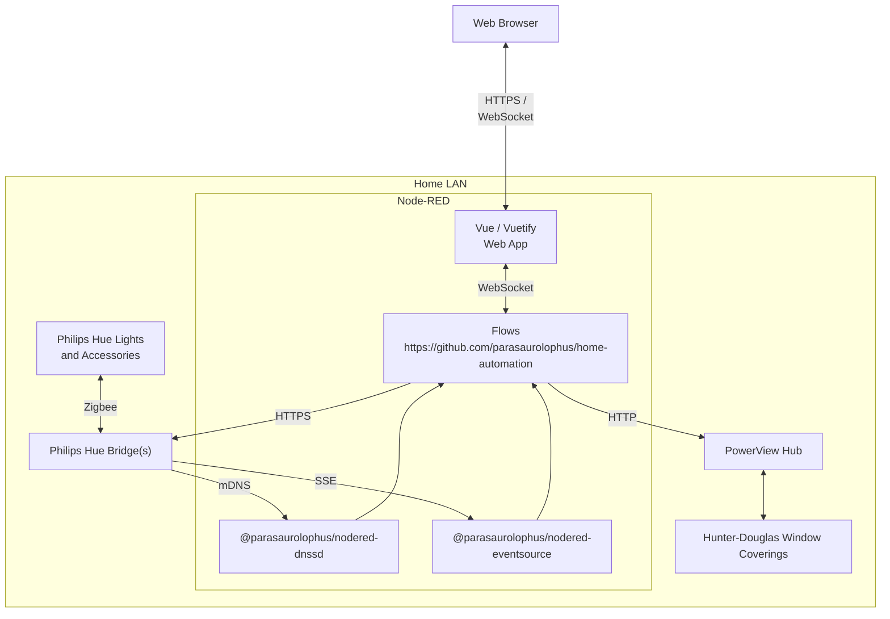

&copy; Copyright Kirk Rader 2023. All rights reserved.

# Home Automation

- <https://github.com/parasaurolophus/home-automation>
- <https://flows.nodered.org/node/@parasaurolophus/node-red-dnssd>
- <https://flows.nodered.org/node/@parasaurolophus/node-red-eventsource>

## Features

- Entirely self-contained [Node-RED](https://nodered.org) based application
  - **No clouds!!**
  - No external configuration outside of _~/.node-red/settings.js_
    - Does require configuration of host running _Node-RED_ and the home
      LAN router in order to support secure access to the dashboard from
      outside the home[*](#https)
  - No additional servers or services required other than those provided
    by the Hue and PowerView hubs
- Consolidated dashboard / web-based UI using
  [Vue](https://vuejs.org/)/[Vuetify](https://vuetifyjs.com/)
  - Requires separate build step after cloning repo from
    GitHub[**](#plainhtml5)
- Time and date based automation
  - Turn on and off lights based on local sunrise / sunset
  - Use special occasion lighting themes based on date
  - Open and close window coverings based on sun's local altitude and
    azimuth on any given day

---

 *If remote access is not a priority, just leave
out the HTTPS related configuration from _~/.node-red/settings.js_. Detailed
instructions for obtaining and installing certificates and configuring IP
reservations and port forwarding on routers are beyond the scope of this web page.

 **An earlier version of this project
implemented the dashboard using pure HTML 5 / JavaScript for its dashboard which
did not have additional build steps. I admit it. I was led astray by the pretty
toggle switches.
