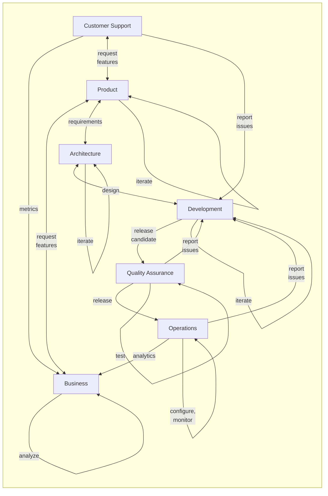

# Software Development Life-Cycle

```mermaid
graph LR

    subgraph "&nbsp;"

        business["Business"]
        support["Customer Support"]
        product["Product"]
        architecture["Architecture"]
        development["Development"]
        qa["Quality Assurance"]
        operations["Operations"]

        product <-- "request\nfeatures" --> business
        support -- "metrics" --> business
        support <-- "request\nfeatures" --> product
        product <-- "requirements" --> architecture
        architecture <-- "design" --> development
        development -- "release\ncandidate" --> qa
        qa -- "report\nissues" --> development
        support -- "report\nissues" --> development
        qa -- "release" --> operations
        operations -- "report\nissues" --> development
        operations -- "analytics" --> business

        business -- "analyze" --> business
        product -- "iterate" --> product
        architecture -- "iterate" --> architecture
        development -- "iterate" --> development
        qa -- "test" --> qa
        operations -- "configure,\nmonitor" --> operations

    end
```
