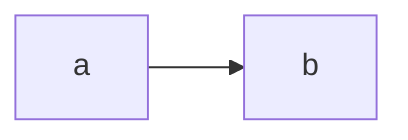

# Test Plugins

## Mermaid

### Source

```mmd
graph LR
    a --> b
```

### Rendered



## MathJax

### Source

```latex
$$
\begin{split}
    \text{Let } \aleph_0 & = \omega \ \omega \\
    \text{where } \omega & = \lambda x . x \ x
\end{split}
$$
```

```markdown
> I.e. $\aleph_0$ is the result returned by a function which calls itself an
> infinite number of times.
```

### Rendered

$$
\begin{split}
    \text{Let } \aleph_0 & = \omega \ \omega \\
    \text{where } \omega & = \lambda x . x \ x
\end{split}
$$

> I.e. $\aleph_0$ is the result returned by a function which calls itself an
> infinite number of times.

## Graphviz

@graphviz_open
digraph G {

    node[shape=circle]

    subgraph injective {

        cluster=true;
        label="injective";
        color=white;

        subgraph injective_domain {
            cluster=true;
            color=black;
            label="domain";

            ia[label="a"];
            ib[label="b"];

            ia -> ib[style=invis];
        }

        subgraph injective_range {
            cluster=true;
            label = "range";
            color=black;

            id[label="d"];
            ie[label="e"];
            if[label="f"];
            id -> ie[style=invis];
            ie -> if[style=invis];
        }

        ia -> id;
        ib -> ie;
    }

    subgraph surjective {

        cluster=true;
        label="surjective";
        color=white;

        subgraph surjective_domain {
            cluster=true;
            color=black;
            label="domain";
            sa[label="a"];
            sb[label="b"];
            sc[label="c"];

            sa -> sb[style=invis];
            sb -> sc[style=invis];
        }

        subgraph surjective_range {
            cluster=true;
            label = "range";
            color=black;

            sd[label="d"];
            se[label="e"];
            sd -> se[style=invis];
        }

        sa -> sd;
        sb -> se;
    }

    subgraph bijective {

        cluster=true;
        label="bijective";
        color=white;

        subgraph bijective_domain {
            cluster=true;
            label="domain";
            color=black;

            ba[label="a"];
            bb[label="b"];
            bc[label="c"];

            ba -> bb[style=invis];
            bb -> bc[style=invis];
        }

        subgraph bijective_range {
            cluster=true;
            label = "co-domain";
            color=black;

            bd[label="d"];
            be[label="e"];
            bf[label="f"];
            bd -> be[style=invis];
            be -> bf[style=invis];
        }

        ba -> bd[dir=both];
        bb -> be[dir=both];
        bc -> bf[dir=both];
    }
}
@graphviz_close
