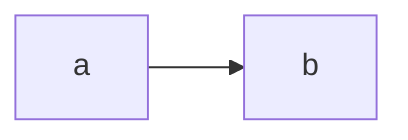

# Test Plugins

## Mermaid

### Source

```mmd
graph LR
    a --> b
```

### Rendered



## MathJax

### Source

```latex
$$
\begin{align}
    & \text{Let } \aleph_0 = \omega \ \omega \\
    & \text{where } \omega = \lambda x . x \ x
\end{align}
```

```markdown
> I.e. $\aleph_0$ is the result returned by a function which calls itself an
> infinite number of times.
```

### Rendered

$$
\begin{align}
    & \text{Let } \aleph_0 = \omega \ \omega \\
    & \text{where } \omega = \lambda x . x \ x
\end{align}
$$

> I.e. $\aleph_0$ is the result returned by a function which calls itself an
> infinite number of times.
