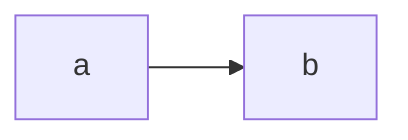

# Test Plugins

## Mermaid

### Source

```mmd
graph LR
    a --> b
```

### Rendered



## MathJax

### Source

```latex
$$
\begin{split}
    \text{Let } \aleph_0 & = \omega \ \omega \\
    \text{where } \omega & = \lambda x . x \ x
\end{split}
$$
```

```markdown
> I.e. $\aleph_0$ is the result returned by a function which calls itself an
> infinite number of times.
```

### Rendered

$$
\begin{split}
    \text{Let } \aleph_0 & = \omega \ \omega \\
    \text{where } \omega & = \lambda x . x \ x
\end{split}
$$

> I.e. $\aleph_0$ is the result returned by a function which calls itself an
> infinite number of times.

## Graphviz

@graphviz_open
digraph {

    label="Injective ('Into') Mapping";
    node[shape=circle]

    subgraph {

        cluster=true;
        label="domain"

        a;
        b;

        a -> b [style=invis];
    }

    subgraph {

        cluster=true;
        label = "range";

        d;
        e;
        f;

        d -> e [style=invis];
        e -> f [style=invis];
    }


    a -> d;
    b -> e;
}
@graphviz_close

---

@graphviz_open
digraph {

    label="Surjective ('Onto') Mapping";
    node[shape=circle]

    subgraph {

        cluster=true;
        label="domain"

        a;
        b;
        c;

        a -> b [style=invis];
        b -> c [style=invis];
    }

    subgraph {

        cluster=true;
        label = "range";

        d;
        e;

        d -> e [style=invis];
    }


    a -> d;
    b -> e;
}
@graphviz_close

---

@graphviz_open
digraph {

    label="Bijective ('1:1') Mapping"
    node[shape=circle]

    subgraph {

        cluster=true;
        label="domain"

        a;
        b;
        c;

        a -> b [style=invis];
        b -> c [style=invis];
    }

    subgraph {

        cluster=true;
        label = "co-domain";

        d;
        e;
        f;

        d -> e [style=invis];
        e -> f [style=invis];
    }


    a -> d [dir=both];
    b -> e [dir=both];
    c -> f [dir=both];
}
@graphviz_close
